# LightBot Architecture

轻量级现代化 Java AI Agent 平台架构设计文档。

---

## 1. 系统整体架构

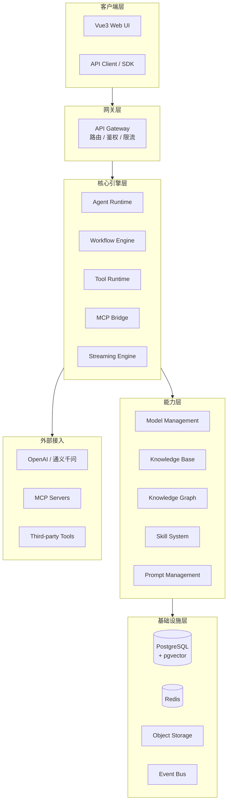

### 架构分层说明

| 层级 | 职责 | 关键设计原则 |
|------|------|-------------|
| **客户端层** | 用户交互、可视化编排 | 前后端分离，SSE 流式渲染 |
| **网关层** | 统一入口、鉴权限流 | API Key 鉴权、多租户隔离 |
| **核心引擎层** | Agent/Workflow/Tool 执行 | 事件驱动、可插拔、有状态 |
| **能力层** | 模型、知识、技能管理 | 能力注册发现、热加载 |
| **基础设施层** | 存储、缓存、消息 | 统一抽象、可替换 |

---

## 2. 模块划分

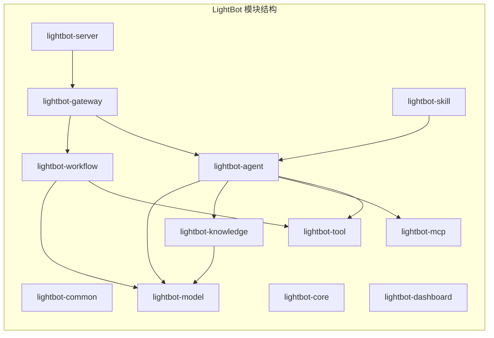

---

## 3. 模块职责

### 3.1 lightbot-common

通用基础层，零业务依赖。

| 组件 | 职责 |
|------|------|
| `common-core` | 通用工具类、Result 封装、异常体系 |
| `common-mybatis` | MyBatis-Plus 配置、分页、审计字段填充 |
| `common-redis` | Redis 工具、分布式锁、缓存注解 |
| `common-web` | 统一响应、全局异常处理、线程池配置 |
| `common-ai` | SpringAI 扩展、消息协议、Token 计算 |

### 3.2 lightbot-core

核心抽象层，定义 SPI 和领域模型。

| 组件 | 职责 |
|------|------|
| `core-spi` | Tool/Model/Knowledge 统一接口 |
| `core-model` | 领域模型：Agent、Workflow、Tool、Message |
| `core-event` | 事件定义：AgentEvent、ToolEvent、WorkflowEvent |
| `core-protocol` | 消息协议：ChatMessage、ToolCall、StreamingChunk |

### 3.3 lightbot-agent

Agent 运行时。

| 组件 | 职责 |
|------|------|
| `agent-runtime` | Agent 实例化、上下文管理、对话循环 |
| `agent-template` | Agent 模板系统、变量注入 |
| `agent-memory` | 会话记忆（短期/长期）、上下文窗口管理 |

### 3.4 lightbot-workflow

Workflow 引擎。

| 组件 | 职责 |
|------|------|
| `workflow-engine` | DAG 解析、拓扑排序、并发执行 |
| `workflow-node` | 节点类型：LLM / Tool / Condition / Variable |
| `workflow-runtime` | 运行时状态机、断点续跑、节点追踪 |

### 3.5 lightbot-tool

Tool 运行时。

| 组件 | 职责 |
|------|------|
| `tool-spi` | Tool 接口定义（@Tool 注解） |
| `tool-builtin` | 内置工具：HTTP、时间、代码执行 |
| `tool-registry` | Tool 注册中心、热加载 |
| `tool-sandbox` | 沙盒执行环境（可选） |

### 3.6 lightbot-mcp

MCP 协议桥接。

| 组件 | 职责 |
|------|------|
| `mcp-client` | MCP Client 实现、Server 连接管理 |
| `mcp-protocol` | JSON-RPC 消息编解码 |
| `mcp-tool-bridge` | MCP Tool 到内部 Tool 的适配 |

### 3.7 lightbot-knowledge

知识管理。

| 组件 | 职责 |
|------|------|
| `knowledge-base` | 知识库 CRUD、文档管理 |
| `knowledge-embed` | 文档解析、分块、向量化 |
| `knowledge-retrieval` | 向量检索、混合检索、重排序 |
| `knowledge-graph` | 知识图谱构建、实体抽取、关系推理 |

### 3.8 lightbot-model

模型管理。

| 组件 | 职责 |
|------|------|
| `model-provider` | 模型供应商适配（OpenAI / 通义千问 / Ollama） |
| `model-router` | 模型路由、负载均衡、降级策略 |
| `model-usage` | Token 计量、费用统计 |

### 3.9 lightbot-skill

Skill 系统。

| 组件 | 职责 |
|------|------|
| `skill-spi` | Skill 接口定义 |
| `skill-registry` | Skill 注册、发现、版本管理 |
| `skill-builtin` | 内置 Skill（总结、翻译、代码生成） |

### 3.10 lightbot-gateway

API 网关。

| 组件 | 职责 |
|------|------|
| `gateway-auth` | API Key 鉴权、JWT、多租户 |
| `gateway-route` | 路由转发、协议适配 |
| `gateway-limit` | 限流、熔断、降级 |

### 3.11 lightbot-server

应用启动模块。

| 组件 | 职责 |
|------|------|
| `server-app` | SpringBoot 启动类、配置 |
| `server-api` | REST API Controller 层 |
| `server-config` | 全局配置、Bean 装配 |

### 3.12 lightbot-dashboard

管理后台（Vue3）。

| 组件 | 职责 |
|------|------|
| `Agent 管理` | Agent 创建、编辑、发布 |
| `Workflow 编辑器` | Vue Flow 画布、节点拖拽 |
| `知识库管理` | 文档上传、检索测试 |
| `模型管理` | 供应商配置、模型列表 |
| `监控面板` | 调用量、Token 消耗、异常统计 |

---

## 4. 模块依赖

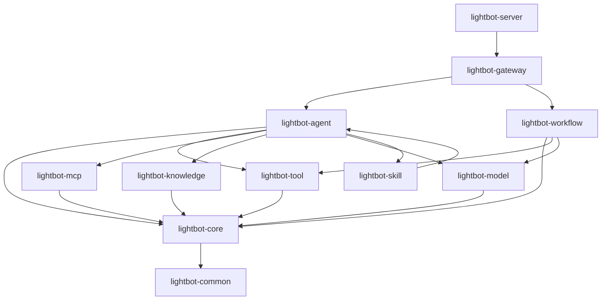

### 依赖规则

1. **单向依赖**：上层依赖下层，禁止反向引用
2. **SPI 解耦**：跨层调用通过 SPI 接口，不直接引用实现
3. **common 零依赖**：common 模块不依赖任何业务模块
4. **core 仅依赖 common**：core 模块只定义抽象，不含实现

---

## 5. 分层架构

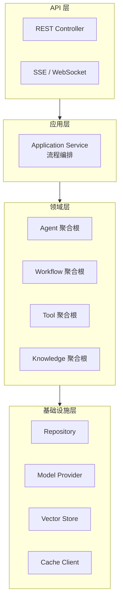

### 各层职责

| 层级 | 职责 | 技术实现 |
|------|------|---------|
| **API 层** | 请求接收、参数校验、响应封装 | Spring MVC + SSE Emitter |
| **应用层** | 用例编排、事务边界、事件发布 | Application Service |
| **领域层** | 业务规则、状态管理、领域事件 | 充血模型 + Domain Event |
| **基础设施层** | 持久化、外部调用、缓存 | MyBatis-Plus + SpringAI |

### 关键设计

- **Agent 为聚合根**：Tool、Memory、Config 作为 Agent 内部实体
- **Workflow 为聚合根**：Node、Edge、Variable 作为 Workflow 内部实体
- **领域事件驱动**：Agent 通过事件与 Workflow/Tool 解耦

---

## 6. Workflow Engine

### 6.1 整体架构

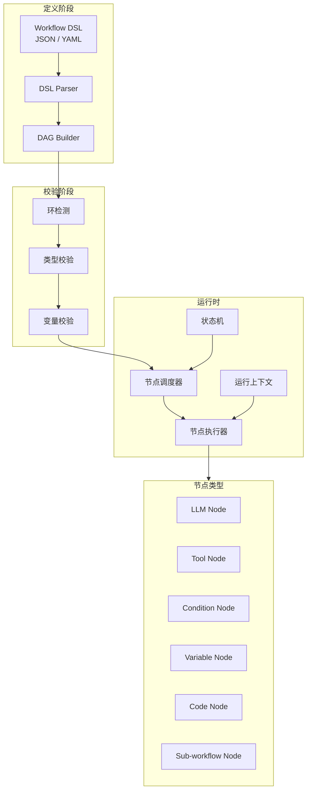

### 6.2 执行流程

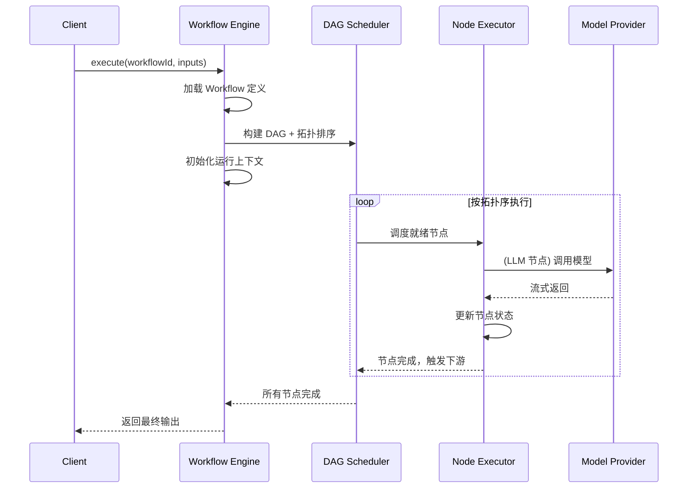

### 6.3 节点协议

```java
public interface WorkflowNode {
    /** 节点类型标识 */
    String getType();

    /** 执行节点逻辑 */
    Mono<NodeResult> execute(NodeContext context);

    /** 校验节点配置 */
    ValidationResult validate(NodeConfig config);
}
```

### 6.4 状态机

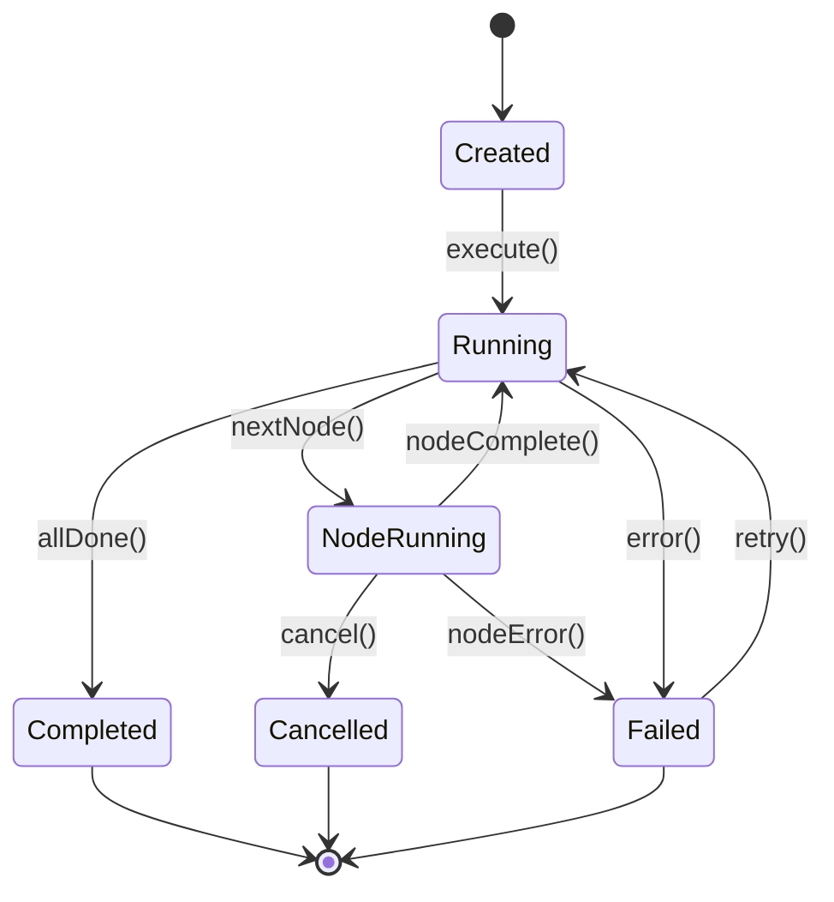

### 6.5 数据传递

| 传递方式 | 场景 | 说明 |
|----------|------|------|
| **变量引用** | `${nodeA.output.field}` | 节点间数据引用 |
| **全局变量** | `${vars.myVar}` | Workflow 级变量 |
| **运行时上下文** | `context.getInput()` | 节点入参 |
| **事件传递** | `NodeOutputEvent` | 异步事件通知 |

---

## 7. Agent Runtime

### 7.1 运行架构

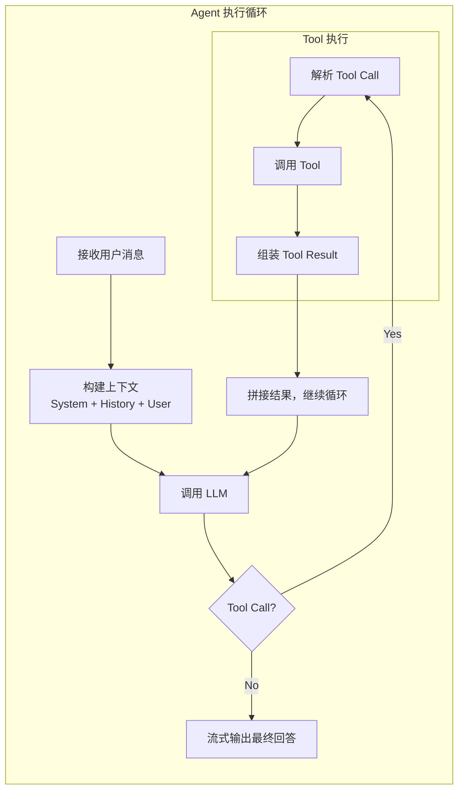

### 7.2 Agent 配置模型

```java
public class AgentConfig {
    private String id;
    private String name;
    private String systemPrompt;        // 系统提示词
    private String modelId;             // 绑定模型
    private List<String> toolIds;       // 可用工具列表
    private List<String> knowledgeIds;  // 关联知识库
    private MemoryConfig memory;        // 记忆配置
    private Map<String, Object> variables; // 模板变量
    private AgentMetadata metadata;     // 元信息
}
```

### 7.3 上下文窗口管理

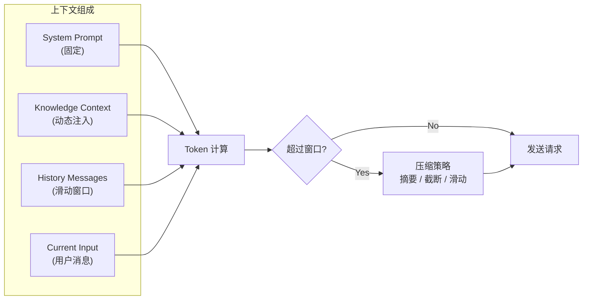

### 7.4 记忆系统

| 类型 | 存储 | 生命周期 | 用途 |
|------|------|---------|------|
| **短期记忆** | Redis | 单次会话 | 当前对话上下文 |
| **长期记忆** | PostgreSQL | 持久化 | 用户偏好、历史摘要 |
| **工作记忆** | 内存 | 单次执行 | Agent 运行时临时状态 |

---

## 8. Tool Runtime

### 8.1 Tool 生命周期

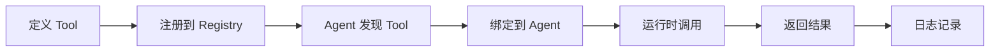

### 8.2 Tool 注册方式

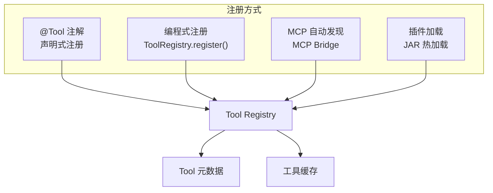

### 8.3 Tool 接口定义

```java
@FunctionalInterface
public interface Tool {

    /**
     * 执行工具
     * @param input   工具入参（JSON Schema 定义）
     * @param context 执行上下文
     * @return 工具执行结果
     */
    ToolResult execute(ToolInput input, ToolContext context);

    /** 工具元数据 */
    default ToolMetadata metadata() {
        return ToolMetadata.from(this);
    }
}
```

### 8.4 Tool 安全策略

| 策略 | 说明 |
|------|------|
| **超时控制** | 单次 Tool 执行最大时长限制 |
| **沙盒隔离** | 代码执行类 Tool 在沙盒中运行 |
| **权限校验** | Tool 执行前校验 Agent 是否有调用权限 |
| **参数校验** | 基于 JSON Schema 校验入参 |
| **结果脱敏** | 敏感字段过滤（API Key、密码等） |

---

## 9. MCP 设计

### 9.1 MCP 架构

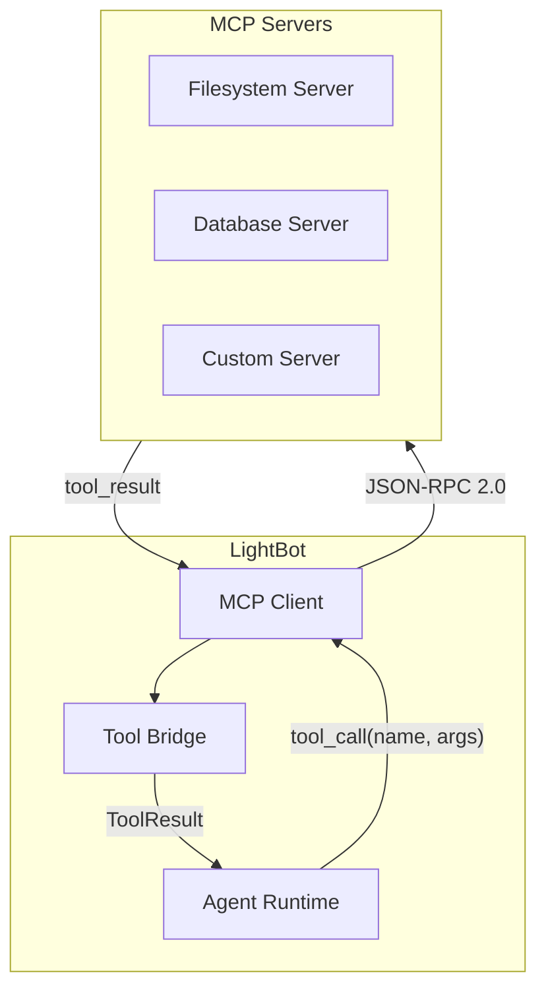

### 9.2 MCP 通信协议

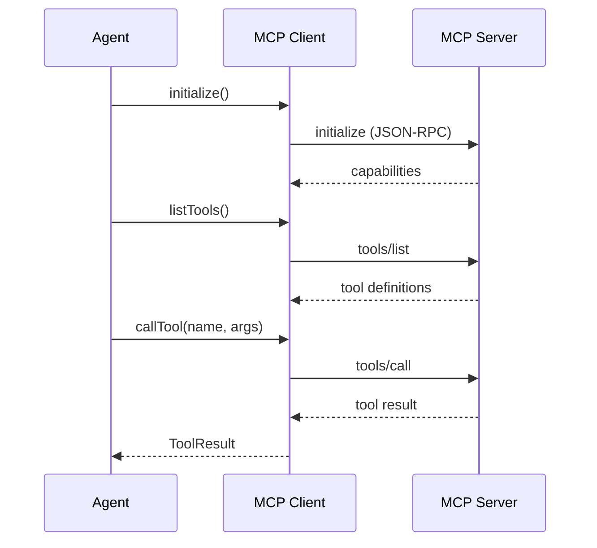

### 9.3 MCP 配置模型

```java
public class MCPConfig {
    private String id;
    private String name;
    private TransportType transport;  // STDIO / SSE / HTTP
    private String endpoint;          // Server 地址
    private Map<String, String> env;  // 环境变量
    private RetryConfig retry;        // 重试策略
    private HealthCheck health;       // 健康检查
}
```

### 9.4 MCP Tool 适配

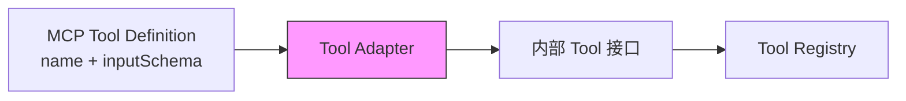

MCP Tool 自动转换为内部 Tool 接口，对 Agent 透明。

---

## 10. RAG 架构

### 10.1 RAG 流程

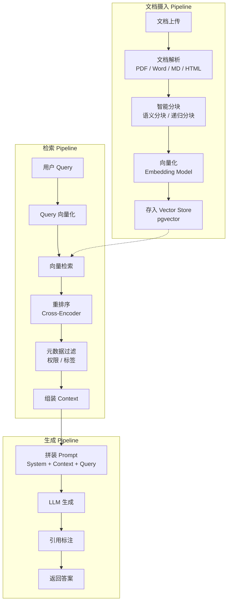

### 10.2 检索策略

| 策略 | 实现 | 适用场景 |
|------|------|---------|
| **向量检索** | pgvector cosine | 语义相似 |
| **关键词检索** | PostgreSQL FTS | 精确匹配 |
| **混合检索** | 向量 + 关键词加权 | 通用场景 |
| **图谱检索** | Knowledge Graph traversal | 实体关系推理 |

### 10.3 分块策略

```java
public interface ChunkStrategy {
    List<DocumentChunk> split(Document document, ChunkConfig config);
}

// 实现
public enum ChunkType {
    RECURSIVE,      // 递归字符分块
    SEMANTIC,       // 语义分块（基于 Embedding 相似度）
    MARKDOWN,       // Markdown 标题分块
    FIXED_SIZE      // 固定大小 + 滑动窗口
}
```

### 10.4 引用追溯

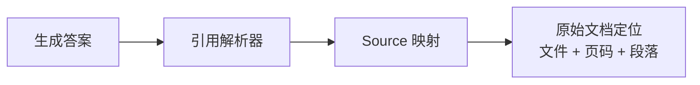

---

## 11. Knowledge 设计

### 11.1 知识库模型

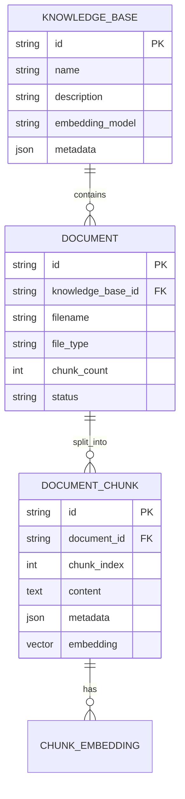

### 11.2 Knowledge Graph

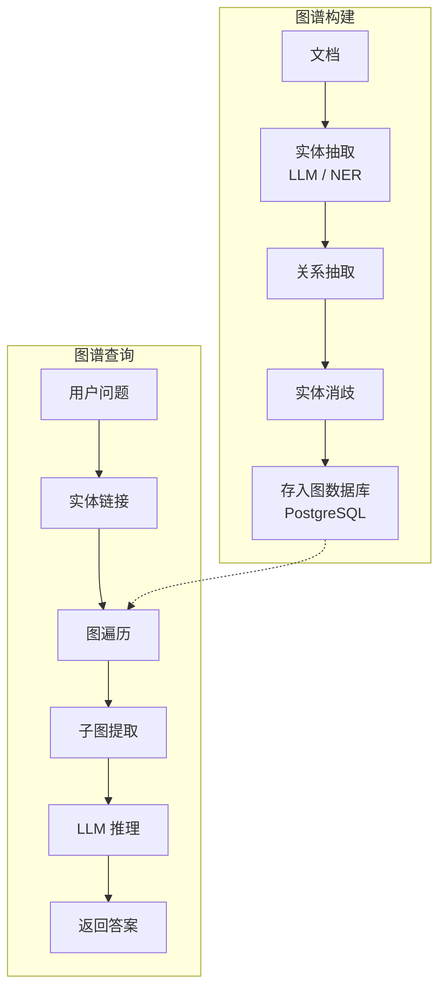

### 11.3 知识检索混合策略

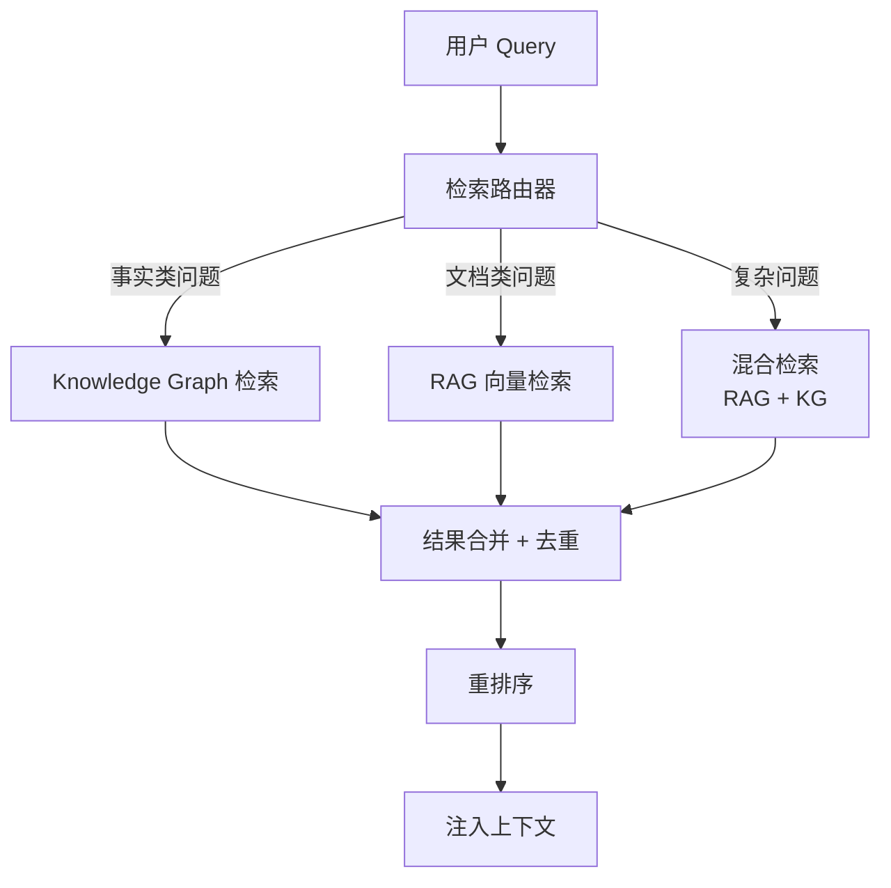

---

## 12. Streaming 设计

### 12.1 流式输出架构

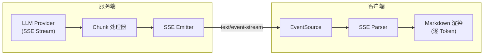

### 12.2 SSE 事件协议

```
event: message_start
data: {"message_id":"xxx","model":"gpt-4"}

event: content_delta
data: {"delta":"你好","index":0}

event: tool_call_start
data: {"tool_name":"search","tool_id":"xxx"}

event: tool_call_delta
data: {"delta":"{\"query\":"}

event: tool_call_end
data: {"tool_id":"xxx","result":{...}}

event: message_end
data: {"usage":{"prompt_tokens":100,"completion_tokens":50}}
```

### 12.3 Tool Call 流式处理

```mermaid
sequenceDiagram
    participant LLM
    participant Server
    participant Client

    LLM->>Server: stream: content delta "让我"
    Server->>Client: event: content_delta

    LLM->>Server: stream: tool_call_start
    Server->>Client: event: tool_call_start

    LLM->>Server: stream: tool_call arguments
    Server->>Client: event: tool_call_delta

    LLM->>Server: stream: tool_call_end
    Server->>Server: 执行 Tool
    Server->>Client: event: tool_call_end + result

    LLM->>Server: stream: 最终回答
    Server->>Client: event: content_delta
    Server->>Client: event: message_end
```

### 12.4 背压控制

```java
// Reactor 背压处理
Flux<ServerSentEvent<ChunkEvent>> stream = agentService
    .streamChat(request)
    .onBackpressureBuffer(256, BufferOverflowStrategy.DROP_OLDEST)
    .map(chunk -> ServerSentEvent.builder(chunk)
        .event(chunk.getType().name())
        .build());
```

---

## 13. 插件化设计

### 13.1 插件体系

```mermaid
graph TB
    subgraph Plugin["插件加载器"]
        Scanner["JAR Scanner"]
        ClassLoader["Plugin ClassLoader"]
        Registry["Plugin Registry"]
    end

    subgraph Extensions["扩展点"]
        ToolExt["Tool SPI"]
        ModelExt["Model Provider SPI"]
        NodeExt["Workflow Node SPI"]
        SkillExt["Skill SPI"]
    end

    subgraph Plugins["插件实现"]
        P1["自定义 Tool 插件"]
        P2["模型供应商插件"]
        P3["自定义节点插件"]
    end

    Scanner --> ClassLoader --> Registry
    Registry --> Extensions
    Plugins --> Extensions
```

### 13.2 扩展点定义

```java
/** Tool 扩展点 */
public interface ToolPlugin {
    List<Tool> getTools();
    PluginMetadata metadata();
}

/** 模型供应商扩展点 */
public interface ModelProviderPlugin {
    ModelProvider getProvider();
    List<String> supportedModels();
}

/** Workflow 节点扩展点 */
public interface NodePlugin {
    List<WorkflowNode> getNodes();
}
```

### 13.3 插件生命周期

```mermaid
stateDiagram-v2
    [*] --> Discovered: 扫描 JAR
    Discovered --> Loaded: 加载类
    Loaded --> Initialized: 调用 init()
    Initialized --> Active: 注册到 Registry
    Active --> Suspended: 卸载请求
    Suspended --> Active: 重新激活
    Active --> Unloaded: 卸载
    Unloaded --> [*]
```

---

## 14. 数据流

### 14.1 用户请求全链路

```mermaid
graph LR
    User["用户"] -->|"HTTP/SSE"| Gateway["API Gateway"]
    Gateway -->|"鉴权通过"| Router["路由分发"]
    Router -->|"Chat 请求"| AgentSvc["Agent Service"]
    Router -->|"Workflow 请求"| WFSvc["Workflow Service"]

    AgentSvc -->|"构建上下文"| CtxBuilder["Context Builder"]
    CtxBuilder -->|"注入知识"| RAGSvc["RAG Service"]
    CtxBuilder -->|"调用模型"| ModelSvc["Model Service"]
    ModelSvc -->|"Tool Call"| ToolSvc["Tool Service"]

    WFSvc -->|"解析 DAG"| DAGParser["DAG Parser"]
    DAGParser -->|"调度节点"| NodeExecutor["Node Executor"]
    NodeExecutor -->|"调用模型"| ModelSvc
    NodeExecutor -->|"调用工具"| ToolSvc

    RAGSvc -->|"查询"| PG["PostgreSQL + pgvector"]
    ModelSvc -->|"调用"| LLM["LLM Provider"]
    ToolSvc -->|"执行"| Tools["Tool 实现"]
```

### 14.2 端到端数据流

```mermaid
sequenceDiagram
    participant User
    participant Gateway
    participant Agent
    participant Context
    participant RAG
    participant Model
    participant Tool
    participant DB

    User->>Gateway: POST /chat (stream=true)
    Gateway->>Gateway: API Key 鉴权
    Gateway->>Agent: forward request

    Agent->>DB: 加载 Agent 配置
    Agent->>Context: 构建上下文

    Context->>RAG: 查询相关知识
    RAG->>DB: pgvector 检索
    DB-->>RAG: Top-K 文档片段
    RAG-->>Context: 知识上下文

    Context->>Model: 调用 LLM (stream)
    Model-->>Agent: 流式返回

    alt Tool Call
        Agent->>Tool: 执行工具
        Tool-->>Agent: 工具结果
        Agent->>Model: 继续对话
    end

    Agent-->>Gateway: SSE 事件流
    Gateway-->>User: text/event-stream
```

### 14.3 Workflow 数据流

```mermaid
sequenceDiagram
    participant Client
    participant Engine
    participant Scheduler
    participant NodeA as Node A (LLM)
    participant NodeB as Node B (Tool)
    participant NodeC as Node C (Condition)

    Client->>Engine: execute(inputs)
    Engine->>Scheduler: 构建 DAG

    Scheduler->>NodeA: 执行（输入: user_query）
    NodeA-->>Scheduler: output: {answer, confidence}

    par 并行执行
        Scheduler->>NodeB: 执行（输入: NodeA.answer）
        Scheduler->>NodeC: 执行（输入: NodeA.confidence）
    end

    NodeC-->>Scheduler: branch: "high"
    Scheduler->>Scheduler: 按条件选择后续节点

    NodeB-->>Scheduler: output: {result}
    Scheduler-->>Engine: 汇总输出
    Engine-->>Client: 最终结果
```

---

## 15. 未来扩展能力

### 15.1 扩展路线图

```mermaid
graph LR
    subgraph Phase1["v0.1 MVP"]
        Chat["基础对话"]
        BasicAgent["基础 Agent"]
        BasicTool["内置 Tool"]
    end

    subgraph Phase2["v0.2 Agent + Tool"]
        AgentTemplate["Agent 模板"]
        CustomTool["自定义 Tool"]
        BasicRAG["基础 RAG"]
    end

    subgraph Phase3["v0.3 Workflow"]
        VisualWF["可视化 Workflow"]
        NodeTypes["多种节点类型"]
        WFDebug["Workflow 调试"]
    end

    subgraph Phase4["v2.0 生产"]
        MultiTenant["多租户"]
        APIKey["API Key 管理"]
        Docker["Docker 部署"]
    end

    subgraph Future["未来规划"]
        MultiAgent["多 Agent 协同"]
        KnowledgeGraph["知识图谱"]
        SkillMarket["Skill 市场"]
        Observability["可观测性"]
    end

    Phase1 --> Phase2 --> Phase3 --> Phase4 --> Future
```

### 15.2 多 Agent 协同（规划中）

```mermaid
graph TB
    subgraph Orchestrator["编排层"]
        Planner["任务规划器"]
        Dispatcher["Agent 调度器"]
    end

    subgraph Agents["Agent 池"]
        A1["研究 Agent"]
        A2["写作 Agent"]
        A3["代码 Agent"]
        A4["审核 Agent"]
    end

    Planner -->|"分解任务"| Dispatcher
    Dispatcher -->|"分发子任务"| Agents
    Agents -->|"返回结果"| Planner
    Planner -->|"汇总结论"| Output["最终输出"]
```

### 15.3 可观测性（规划中）

| 维度 | 指标 | 实现 |
|------|------|------|
| **Trace** | 请求链路追踪 | OpenTelemetry |
| **Metrics** | Token 消耗、延迟、QPS | Prometheus + Grafana |
| **Logs** | Agent 执行日志、Tool 调用日志 | ELK / Loki |
| **Eval** | 回答质量评估、RAG 准确率 | 自定义评估框架 |

### 15.4 渐进式演进策略

| 阶段 | 架构形态 | 触发条件 |
|------|---------|---------|
| **当前** | 单体应用 | 起步阶段 |
| **中期** | 模块化单体 | 模块边界清晰后 |
| **远期** | 微服务（按需拆分） | 独立扩展需求出现 |

> **核心原则**：不过度设计。单体优先，模块边界清晰后再考虑拆分。

---

## 附录：技术选型

| 组件 | 选型 | 理由 |
|------|------|------|
| **框架** | SpringBoot 3.x | Java 生态主流，SpringAI 原生支持 |
| **AI SDK** | SpringAI | 统一模型抽象，Spring 生态融合 |
| **前端** | Vue3 + TypeScript | 轻量、生态成熟 |
| **工作流画布** | Vue Flow | Vue3 原生 DAG 编辑器 |
| **数据库** | PostgreSQL + pgvector | 关系 + 向量一体化 |
| **缓存** | Redis | 会话、限流、分布式锁 |
| **ORM** | MyBatis-Plus | 灵活 SQL + 代码生成 |
| **文档解析** | Apache Tika | 多格式统一解析 |
| **构建** | Maven | Java 项目标准构建 |

---

*Last updated: 2026-05-19*
