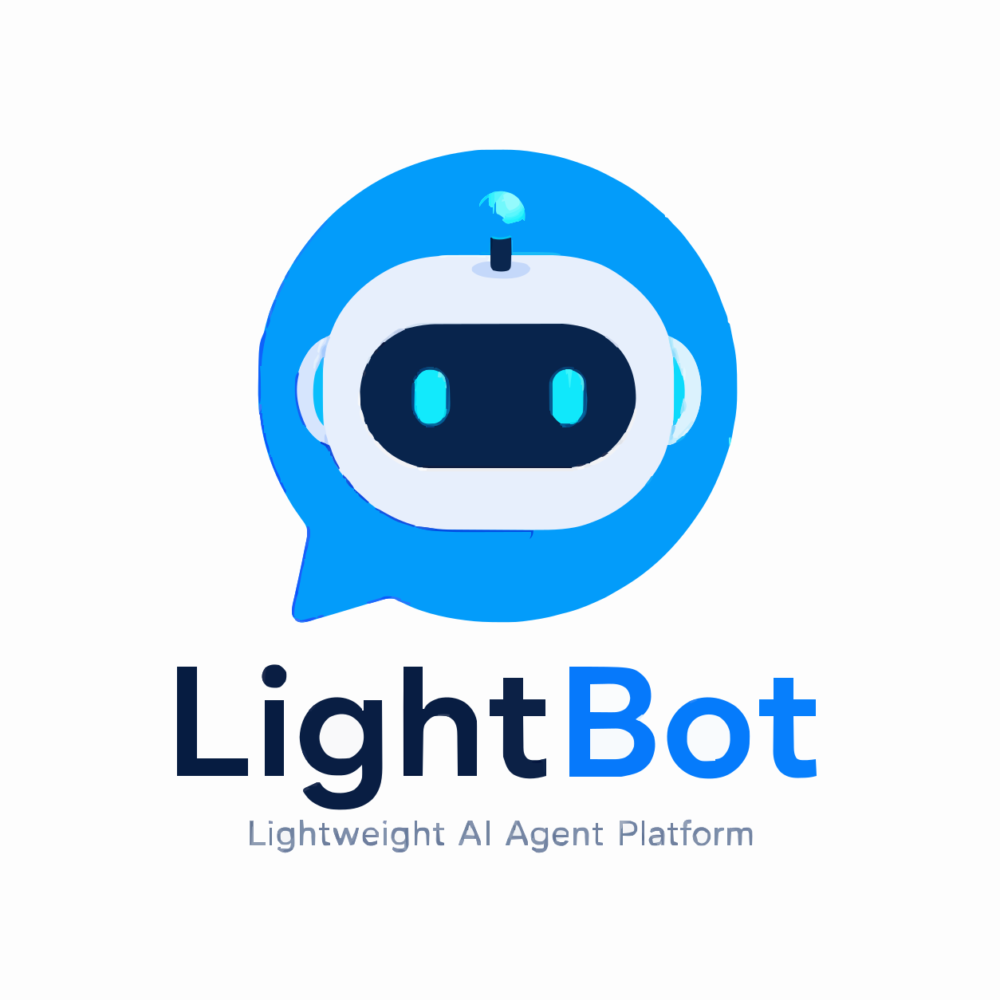

<p align="center">
    
</p>

<h1 align="center">LightBot</h1>

<p align="center">
    <strong>轻量级现代化 Java AI Agent 平台</strong>
</p>

<p align="center">
    <em>Lightweight, Modern, Enterprise-grade Java AI Agent Platform</em>
</p>

<p align="center">
    <a href="https://github.com/finch04/LightBot/actions">
        
    </a>
    <a href="https://github.com/finch04/LightBot/releases">
        
    </a>
    <a href="https://github.com/finch04/LightBot/blob/main/LICENSE">
        
    </a>
    <a href="https://github.com/finch04/LightBot">
        
    </a>
    <a href="https://github.com/finch04/LightBot">
        
    </a>
    <a href="https://github.com/finch04/LightBot/issues">
        
    </a>
</p>

<p align="center">
    <a href="#-快速开始">Quick Start</a> &bull;
    <a href="#-docker-部署">Docker</a> &bull;
    <a href="#-模块设计">Modules</a> &bull;
    <a href="#-roadmap">Roadmap</a> &bull;
    <a href="#-contributing">Contributing</a> &bull;
    <a href="https://github.com/finch04/LightBot/wiki">Docs</a>
</p>

---

## 项目介绍

**LightBot** 是一个基于 [Spring AI](https://docs.spring.io/spring-ai/reference/) 的轻量级 Java AI Agent 平台。它为 Java 开发者提供了一套从 Agent 构建、Workflow 编排、知识库管理到模型接入的完整解决方案。

### 为什么选择 LightBot？

在 AI Agent 浪潮中，Python 生态（LangChain、Dify）已先行一步，但 Java 生态在企业级场景中仍具备不可替代的优势：**高性能、强类型、成熟的中间件体系、庞大的开发者社区**。LightBot 致力于将这些优势与 AI Agent 能力深度结合，为 Java 开发者提供一条 **AI Native** 的技术路径。

| 维度 | LightBot | Dify | LangChain |
|------|----------|------|-----------|
| 语言 | **Java** | Python | Python |
| 框架 | **Spring AI** | Flask | - |
| 定位 | **Agent Framework + Platform** | Application Platform | Framework |
| 部署 | **单体 / Docker Compose** | Docker Compose | Library |
| 企业集成 | **Spring 生态无缝集成** | API 为主 | API 为主 |
| 工作流 | **可视化 + DAG 引擎** | 可视化 | LangGraph |

## 项目特性

- **Agent 引擎** — 基于 Spring AI 构建，支持系统提示词、变量注入、多模型切换，开箱即用
- **Workflow 编排** — 可视化 DAG 工作流画布，支持 LLM 节点、Tool 节点、条件分支、变量赋值
- **Tool Calling** — 标准化 Tool 协议，支持 Java 注册、MCP 协议、热插拔机制
- **MCP 协议** — 内置 Model Context Protocol 支持，与外部工具生态无缝对接
- **Skill 系统** — 可复用的 Agent 技能包，支持组合与继承
- **知识库** — 文档上传、向量检索（pgvector）、RAG 全链路支持
- **知识图谱** — 结构化知识表示与图谱检索增强
- **模型管理** — 多模型统一接入（OpenAI / 通义千问 / DeepSeek / Ollama 等），模型路由与负载均衡
- **Dashboard** — 运行指标、调用链路、Token 消耗可视化

## 系统架构

```
┌─────────────────────────────────────────────────────────────────────┐
│                         LightBot Platform                          │
├─────────────────────────────────────────────────────────────────────┤
│  Frontend (Vue 3 + Element Plus)                                   │
│  ┌──────────┐ ┌──────────┐ ┌──────────┐ ┌──────────┐ ┌──────────┐ │
│  │ Dashboard │ │ Agent    │ │ Workflow │ │ Knowledge│ │ Model    │ │
│  │          │ │ Editor   │ │ Canvas   │ │ Base     │ │ Manager  │ │
│  └──────────┘ └──────────┘ └──────────┘ └──────────┘ └──────────┘ │
├─────────────────────────────────────────────────────────────────────┤
│  API Gateway / RESTful API                                          │
├─────────────────────────────────────────────────────────────────────┤
│  Backend (Spring Boot 3 + Spring AI)                               │
│  ┌──────────────────────────────────────────────────────────────┐   │
│  │                    Agent Runtime                              │   │
│  │  ┌─────────┐ ┌─────────┐ ┌─────────┐ ┌─────────┐           │   │
│  │  │ Prompt  │ │ Memory  │ │ Tool    │ │ MCP     │           │   │
│  │  │ Engine  │ │ Manager │ │ Calling │ │ Client  │           │   │
│  │  └─────────┘ └─────────┘ └─────────┘ └─────────┘           │   │
│  ├──────────────────────────────────────────────────────────────┤   │
│  │                    Workflow Engine                            │   │
│  │  ┌─────────┐ ┌─────────┐ ┌─────────┐ ┌─────────┐           │   │
│  │  │ DAG     │ │ Node    │ │ Variable│ │ Debug   │           │   │
│  │  │ Scheduler│ │Executor │ │ Context │ │ Tracer  │           │   │
│  │  └─────────┘ └─────────┘ └─────────┘ └─────────┘           │   │
│  ├──────────────────────────────────────────────────────────────┤   │
│  │                    Knowledge Layer                            │   │
│  │  ┌─────────┐ ┌─────────┐ ┌─────────┐                       │   │
│  │  │ RAG     │ │ Vector  │ │Knowledge│                       │   │
│  │  │ Pipeline│ │ Store   │ │ Graph   │                       │   │
│  │  └─────────┘ └─────────┘ └─────────┘                       │   │
│  ├──────────────────────────────────────────────────────────────┤   │
│  │                    Model Layer                                │   │
│  │  ┌─────────┐ ┌─────────┐ ┌─────────┐ ┌─────────┐           │   │
│  │  │ OpenAI  │ │ Tongyi  │ │ DeepSeek│ │ Ollama  │           │   │
│  │  └─────────┘ └─────────┘ └─────────┘ └─────────┘           │   │
│  └──────────────────────────────────────────────────────────────┘   │
├─────────────────────────────────────────────────────────────────────┤
│  Storage Layer                                                      │
│  ┌──────────────┐  ┌──────────────┐  ┌──────────────┐             │
│  │  PostgreSQL   │  │    Redis     │  │   pgvector   │             │
│  │  (主数据存储)  │  │  (缓存/会话) │  │  (向量检索)   │             │
│  └──────────────┘  └──────────────┘  └──────────────┘             │
└─────────────────────────────────────────────────────────────────────┘
```

## 技术栈

### 后端

| 技术 | 版本 | 说明 |
|------|------|------|
| Java | 17+ | LTS 版本 |
| Spring Boot | 3.3+ | 应用框架 |
| Spring AI | 1.1+ | AI 应用框架 |
| MyBatis-Plus | 3.5+ | ORM 框架 |
| PostgreSQL | 15+ | 主数据库 |
| pgvector | 0.7+ | 向量检索扩展 |
| Redis | 7+ | 缓存与会话管理 |
| Sa-Token | 1.40+ | 权限认证 |
| JGraphT | 1.5+ | DAG 工作流引擎 |
| MCP SDK | 0.9+ | Model Context Protocol |

### 前端

| 技术 | 版本 | 说明 |
|------|------|------|
| Vue | 3.4+ | 前端框架 |
| Element Plus | 2.x | UI 组件库 |
| Vue Flow | 1.x | 工作流画布 |
| Pinia | 2.x | 状态管理 |
| Axios | 1.x | HTTP 客户端 |
| Vite | 5.x | 构建工具 |

### 模型支持

| 提供商 | 模型 |
|--------|------|
| OpenAI | GPT-4o / GPT-4o-mini |
| 通义千问 | Qwen-Max / Qwen-Plus |
| DeepSeek | DeepSeek-V3 / DeepSeek-R1 |
| Ollama | Llama / Qwen / 本地模型 |
| 自定义 | 任何 OpenAI 兼容 API |

## 模块设计

```
lightbot/
├── lightbot-server/            # 启动模块
│   └── src/main/java/          # Application 入口
├── lightbot-core/              # 核心模块
│   ├── agent/                  # Agent 引擎
│   ├── workflow/               # Workflow DAG 引擎
│   ├── tool/                   # Tool Calling 框架
│   ├── mcp/                    # MCP 协议支持
│   ├── skill/                  # Skill 系统
│   ├── knowledge/              # 知识库 & RAG
│   ├── model/                  # 模型管理 & 路由
│   └── common/                 # 公共工具 & 基础设施
├── lightbot-openapi/           # 开放 API 模块
│   └── sdk/                    # Java / Python SDK
├── lightbot-admin/             # 管理后台 (可选)
├── lightbot-ui/                # 前端工程 (Vue 3)
├── docker/                     # Docker 配置
│   ├── docker-compose.yml
│   └── middleware/             # 中间件配置
└── docs/                       # 项目文档
```

### 模块职责

| 模块 | 职责 | 核心能力 |
|------|------|----------|
| `lightbot-server` | 应用启动、配置加载 | Spring Boot 启动入口 |
| `lightbot-core` | 核心业务逻辑 | Agent、Workflow、Tool、RAG 全链路 |
| `lightbot-openapi` | 对外 API 暴露 | RESTful API、SDK、Webhook |
| `lightbot-admin` | 管理后台 | 用户管理、权限控制、系统配置 |
| `lightbot-ui` | 前端界面 | 对话、编排、管理、可视化 |

## 快速开始

### 环境要求

- JDK 17+
- Node.js 18+
- PostgreSQL 15+（需安装 pgvector 扩展）
- Redis 7+

### 1. 克隆项目

```bash
git clone https://github.com/finch04/LightBot.git
cd LightBot
```

### 2. 初始化数据库

```bash
# 安装 pgvector 扩展（PostgreSQL）
CREATE EXTENSION IF NOT EXISTS vector;

# 导入初始化脚本
psql -U postgres -d lightbot -f sql/init.sql
```

### 3. 启动后端

```bash
# 配置 application.yml 中的数据库和 Redis 连接信息
# 配置模型 API Key（OpenAI / 通义千问 / DeepSeek）

cd lightbot-server
mvn spring-boot:run
```

### 4. 启动前端

```bash
cd lightbot-ui
pnpm install
pnpm dev
```

访问 http://localhost:5173 开始使用。

## Docker 部署

### 一键部署

```bash
docker-compose up -d
```

### docker-compose.yml

```yaml
version: '3.8'

services:
  lightbot-server:
    image: finch04/lightbot-server:latest
    container_name: lightbot-server
    ports:
      - "8080:8080"
    environment:
      - SPRING_DATASOURCE_URL=jdbc:postgresql://postgres:5432/lightbot
      - SPRING_DATASOURCE_USERNAME=postgres
      - SPRING_DATASOURCE_PASSWORD=lightbot
      - SPRING_DATA_REDIS_HOST=redis
      - SPRING_DATA_REDIS_PORT=6379
    depends_on:
      - postgres
      - redis
    restart: unless-stopped

  lightbot-ui:
    image: finch04/lightbot-ui:latest
    container_name: lightbot-ui
    ports:
      - "5173:80"
    depends_on:
      - lightbot-server
    restart: unless-stopped

  postgres:
    image: pgvector/pgvector:pg16
    container_name: lightbot-postgres
    environment:
      - POSTGRES_DB=lightbot
      - POSTGRES_USER=postgres
      - POSTGRES_PASSWORD=lightbot
    volumes:
      - postgres_data:/var/lib/postgresql/data
      - ./sql/init.sql:/docker-entrypoint-initdb.d/init.sql
    ports:
      - "5432:5432"
    restart: unless-stopped

  redis:
    image: redis:7-alpine
    container_name: lightbot-redis
    ports:
      - "6379:6379"
    volumes:
      - redis_data:/data
    restart: unless-stopped

volumes:
  postgres_data:
  redis_data:
```

## 开发计划

### v0.1 — MVP

> 跑通最小闭环，验证架构可行性

| 模块 | 功能 |
|------|------|
| Chat | 单轮对话、多轮对话、流式输出（SSE） |
| Agent | 基础 Agent 定义（系统提示词 + 模型配置） |
| Tool | 内置工具：HTTP 请求、当前时间 |
| Model | OpenAI / 通义千问 接入 |
| Storage | 会话历史持久化 |

### v0.2 — Agent + Tool 体系

> 建立可扩展的 Agent 和 Tool 体系

| 模块 | 功能 |
|------|------|
| Agent | Agent 模板、变量注入、多模型切换 |
| Tool | 自定义 Tool（Java 注册）、Tool 编排 |
| RAG | 文档上传、向量检索、知识库管理 |
| Frontend | Agent 编辑器、知识库管理页 |

### v0.3 — Workflow 引擎

> 实现可视化 Workflow 编排

| 模块 | 功能 |
|------|------|
| Workflow | 可视化画布（Vue Flow）、节点拖拽 |
| Node | LLM 节点、Tool 节点、条件分支、变量赋值 |
| Runtime | Workflow 执行引擎、节点状态追踪 |
| Debug | 单节点调试、运行日志、变量查看 |

### v1.0 — 生产可用

> 生产级稳定性，开放使用

| 模块 | 功能 |
|------|------|
| Auth | 注册 / 登录、API Key 管理 |
| Tenant | 多租户、资源隔离 |
| Deploy | Docker 镜像、一键部署脚本 |
| API | RESTful API、SDK（Java / Python） |
| Stability | 限流、熔断、异常兜底 |

## Roadmap

```
2025 Q2 ──────────────────────────────────────────────────────────────
│  v0.1 MVP
│  ├── Agent 基础能力
│  ├── 对话 & 流式输出
│  ├── Tool Calling 框架
│  └── 模型接入（OpenAI / 通义千问）

2025 Q3 ──────────────────────────────────────────────────────────────
│  v0.2 Agent + Tool 体系
│  ├── Agent 模板 & 变量注入
│  ├── 自定义 Tool & MCP 协议
│  ├── RAG & 知识库（pgvector）
│  └── 管理后台前端

2025 Q4 ──────────────────────────────────────────────────────────────
│  v0.3 Workflow 引擎
│  ├── DAG 工作流引擎
│  ├── 可视化画布（Vue Flow）
│  ├── 节点调试 & 运行日志
│  └── Knowledge Graph

2026 Q1 ──────────────────────────────────────────────────────────────
│  v1.0 生产可用
│  ├── 用户体系 & 多租户
│  ├── RESTful API & SDK
│  ├── Docker 一键部署
│  └── Dashboard & 监控
```

## Contributing

我们欢迎任何形式的贡献！

### 如何贡献

1. Fork 本仓库
2. 创建特性分支：`git checkout -b feature/amazing-feature`
3. 提交更改：`git commit -m 'feat: add amazing feature'`
4. 推送分支：`git push origin feature/amazing-feature`
5. 提交 Pull Request

### 开发规范

- 遵循 [Conventional Commits](https://www.conventionalcommits.org/) 规范
- 代码风格遵循项目 Checkstyle 配置
- 新增功能需附带单元测试
- PR 需通过 CI 检查

### 行为准则

本项目遵循 [Contributor Covenant](https://www.contributor-covenant.org/) 行为准则。

## License

本项目基于 [Apache License 2.0](LICENSE) 开源。

```
Licensed to the Apache Software Foundation (ASF) under one or more
contributor license agreements.  See the NOTICE file distributed with
this work for additional information regarding copyright ownership.
The ASF licenses this file to You under the Apache License, Version 2.0
(the "License"); you may not use this file except in compliance with
the License.  You may obtain a copy of the License at

    http://www.apache.org/licenses/LICENSE-2.0

Unless required by applicable law or agreed to in writing, software
distributed under the License is distributed on an "AS IS" BASIS,
WITHOUT WARRANTIES OR CONDITIONS OF ANY KIND, either express or implied.
See the License for the specific language governing permissions and
limitations under the License.
```

---

<p align="center">
    <em>LightBot — 让 Java 开发者拥抱 AI Agent 时代</em>
</p>
