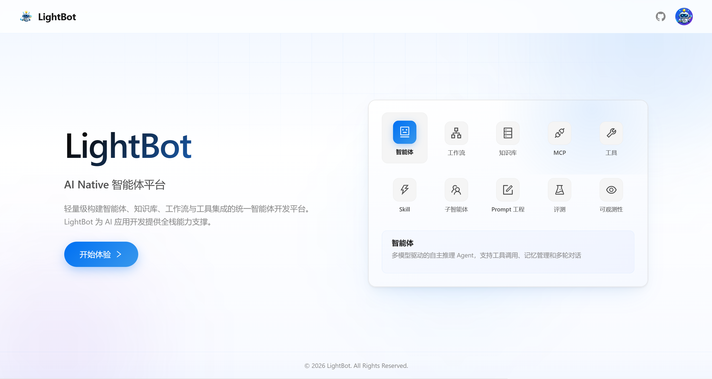
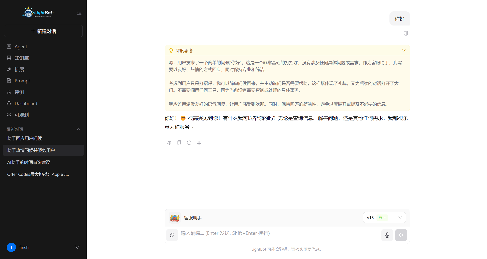

<p align="center">
    
</p>

<h1 align="center">LightBot</h1>

<p align="center">
    <strong>轻量级现代化 Java AI Agent 平台</strong>
</p>

<p align="center">
    <em>Lightweight, Modern, Enterprise-grade Java AI Agent Platform</em>
</p>

<p align="center">
    <!-- <a href="https://github.com/finch04/LightBot/actions">
        
    </a>
    <a href="https://github.com/finch04/LightBot/releases">
        
    </a>
    <a href="https://github.com/finch04/LightBot/blob/main/LICENSE">
        
    </a> -->
    <a href="https://github.com/finch04/LightBot">
        
    </a>
    <a href="https://github.com/finch04/LightBot">
        
    </a>
    <a href="https://github.com/finch04/LightBot/issues">
        
    </a>
</p>

<p align="center">
    <a href="#-快速开始">Quick Start</a> &bull;
    <a href="QUICKSTART.md">详细启动指南</a> &bull;
    <a href="#-功能特性">Features</a> &bull;
    <a href="#-系统架构">Architecture</a> &bull;
    <a href="#-技术栈">Tech Stack</a> &bull;
    <a href="ROADMAP.md">Roadmap</a> &bull;
    <a href="#-contributing">Contributing</a>
</p>

---

## 项目介绍

**LightBot** 是一个基于 [Spring AI](https://docs.spring.io/spring-ai/reference/) 的轻量级 Java AI Agent 平台。它为 Java 开发者提供了一套从 **Agent 构建、Workflow 编排、RAG 知识库、Tool Calling、MCP 协议接入到全链路可观测**的完整解决方案。

### 为什么选择 LightBot？

在 AI Agent 浪潮中，Python 生态（LangChain、Dify）已先行一步，但 Java 生态在企业级场景中仍具备不可替代的优势：**高性能、强类型、成熟的中间件体系、庞大的开发者社区**。LightBot 致力于将这些优势与 AI Agent 能力深度结合，为 Java 开发者提供一条 **AI Native** 的技术路径。

| 维度 | LightBot | Dify | LangChain |
|------|----------|------|-----------|
| 语言 | **Java** | Python | Python |
| 框架 | **Spring AI** | Flask | - |
| 定位 | **Agent Framework + Platform** | Application Platform | Framework |
| 部署 | **单体 / Docker Compose** | Docker Compose | Library |
| 企业集成 | **Spring 生态无缝集成** | API 为主 | API 为主 |
| 工作流 | **可视化 DAG + 9 种节点** | 可视化 | LangGraph |
| RAG | **向量 + 知识图谱 + QA 对** | 向量检索 | 向量检索 |
| 评测 | **内置 Eval 体系** | 无 | 无 |

---

## 项目展示

|  |                                                              |
|:---:|:---:|
|  |  |
| Landing 首页 | 多轮对话 + 流式输出 |
|  |  |
| Agent 详情 | 可视化工作流编排 |
|  |  |
| 知识库管理 + 统计 | RAG 检索测试 |
|  |  |
| 知识图谱可视化 | 全链路 Trace 追踪 |
|  |  |
| 评测实验 | Prompt 版本管理 |

---

## 功能特性

### Agent 引擎

- 基于 Spring AI 构建，支持系统提示词、变量注入、多模型切换
- AI 一键生成系统提示词和推荐问题
- Agent 版本管理：草稿 / 发布 / 回滚 / 历史版本对比
- SubAgent 多 Agent 编排，支持工具和模型覆盖
- 欢迎语、推荐问题、头像自定义

### Workflow 可视化编排

- 基于 Vue Flow 的可视化 DAG 工作流画布
- **9 种节点类型**：Start、End、LLM、Condition、Classifier、Tool、Retrieval、Loop、Batch
- 画布内拖拽编排、连线插入、节点配置面板
- 工作流草稿保存 / 发布 / 版本管理 / 版本回滚
- 单节点调试 + 全流程调试，实时查看运行日志和变量
- 工作流合法性校验（连通性、节点配置完整性）

### Tool Calling 体系

- 标准化 Tool 协议：JSON Schema 定义输入输出
- **3 种 Tool 类型**：内置工具、自定义工具、MCP 工具
- 系统工具自动注入所有 Agent，无需手动绑定
- Tool 在线测试执行，查看实际输入输出
- 工具调用记录完整追溯

### MCP 协议支持

- 内置 [Model Context Protocol](https://modelcontextprotocol.io/) 支持
- **3 种传输方式**：SSE、stdio、StreamableHTTP
- MCP Server 连接测试、工具自动发现
- 单工具粒度启用/禁用控制
- 与 Agent 绑定，开箱即用

### Skill 技能系统

- 可复用的 Agent 技能包，绑定 Prompt 模板 + 工具 + MCP Server
- 全局技能 / Agent 专属技能两级作用域
- 内置技能 + 自定义技能，支持启用/禁用
- 通过 slug 标识符快速引用

### RAG 知识库

- **完整 RAG Pipeline**：文档上传 → 分块 → 向量化 → 检索 → 生成
- 多格式文档支持（PDF、Word、Markdown、TXT 等），支持 OCR
- URL 内容抓取入库，批量上传
- 可配置分块策略（策略/大小/重叠/分隔符），支持分块预览
- 向量检索（pgvector + HNSW 索引）+ Rerank 重排序
- 流式 RAG 问答（SSE），返回引用来源
- 知识库统计（文档数/分片数/Token 数）实时更新，支持手动全量重算
- 知识库成员权限管理（creator/manager/developer/viewer）

### 知识图谱

- Neo4j 图数据库驱动，结构化知识表示
- AI 自动从文档中提取实体和关系
- JSONL 批量导入三元组
- 图谱可视化（子图展示、统计信息）
- 语义搜索图节点
- 支持知识库级图谱 + 全局独立图谱

### QA 对管理

- 手动创建 / 批量导入 / AI 自动生成问答对
- 问答对独立向量化，支持语义检索
- 与文档向量互补，提升 RAG 召回率

### 模型管理

- 多提供商统一接入（OpenAI / 通义千问 / DeepSeek / Ollama / 任意 OpenAI 兼容 API）
- 动态配置字段，每个提供商独立配置表单
- 模型自动发现：一键拉取提供商可用模型列表
- 连接测试：保存前/后均可验证 API Key 和连通性
- 模型分类：Chat / Embedding / TTS / Rerank 四种类型
- 全局默认模型配置（默认对话模型、嵌入模型、TTS 模型、Rerank 模型）

### Prompt 工程

- Prompt CRUD + 版本管理（版本号、变更描述、状态）
- 16 个内置构建模板（通用助手、代码审查、翻译、数据分析等）
- 在线调试运行（SSE 流式输出），实时预览效果
- 变量定义 + 模型配置 + 工具配置一体化

### 评测体系 (Eval)

- **数据集管理**：创建、版本管理、批量导入数据条目
- **评估器管理**：自定义评估 Prompt + 变量，内置模板（文本相似度、代码质量、情感分析）
- **实验管理**：选择数据集 + 评估器 → 运行实验 → 查看评分和推理过程
- **RAG 专项评测**：Benchmark 自动生成 / 上传，检索准确率 + 回答质量双维度评分

### 对话系统

- 同步对话 + 流式对话（SSE）
- 多会话管理：创建、归档、置顶、删除
- 消息历史分页加载
- 图片/视频附件上传，支持预览
- RAG 引用来源展示
- Token 消耗统计

### 全链路可观测

- **LLM Trace**：调用链追踪，Span 级别明细，Token 消耗 / 延迟 / 状态
- **工具调用日志**：完整记录每次 Tool 调用的输入、输出、状态
- **实时日志流**：SSE 推送后端日志，支持历史查询
- **Dashboard**：Agent 数量、知识库规模、对话量、Token 消耗可视化统计
- **异步任务中心**：任务队列实时推送（SSE），支持取消、进度查看

### 系统管理

- Sa-Token 权限认证，JWT 风格 Token
- 用户注册 / 登录 / 个人信息 / 密码修改
- 系统配置管理（默认模型、AI 提供商等）
- Swagger API 文档自动生成

---

## 系统架构

```
┌─────────────────────────────────────────────────────────────────────────┐
│                        Frontend (Vue 3 + Ant Design Vue)                │
│  ┌──────────┐ ┌──────────┐ ┌──────────┐ ┌──────────┐ ┌──────────┐     │
│  │  Chat    │ │ Workflow │ │ Knowledge│ │  Eval   │ │Dashboard │     │
│  │  对话    │ │  编排    │ │  知识库  │ │  评测   │ │  统计    │     │
│  └──────────┘ └──────────┘ └──────────┘ └──────────┘ └──────────┘     │
│  ┌──────────┐ ┌──────────┐ ┌──────────┐ ┌──────────┐ ┌──────────┐     │
│  │  Agent   │ │   Tool   │ │   MCP    │ │  Prompt │ │  Trace   │     │
│  │  管理    │ │   管理   │ │   管理   │ │  工程   │ │  可观测  │     │
│  └──────────┘ └──────────┘ └──────────┘ └──────────┘ └──────────┘     │
├─────────────────────────────────────────────────────────────────────────┤
│                        Backend (Spring Boot 3 + Spring AI)              │
│  ┌────────────────────────────────────────────────────────────────┐     │
│  │                    Agent Runtime                                │     │
│  │  ┌─────────┐ ┌─────────┐ ┌─────────┐ ┌─────────┐ ┌─────────┐│     │
│  │  │ Prompt  │ │ Memory  │ │ Tool    │ │ MCP     │ │SubAgent ││     │
│  │  │ Engine  │ │ Manager │ │ Calling │ │ Client  │ │ Runtime ││     │
│  │  └─────────┘ └─────────┘ └─────────┘ └─────────┘ └─────────┘│     │
│  ├────────────────────────────────────────────────────────────────┤     │
│  │                    Workflow Engine (DAG)                        │     │
│  │  ┌─────────┐ ┌─────────┐ ┌─────────┐ ┌─────────┐ ┌─────────┐│     │
│  │  │ Start   │ │  LLM    │ │Condition│ │  Tool   │ │  Loop   ││     │
│  │  │ End     │ │Classify │ │Retrieval│ │  Batch  │ │Variable ││     │
│  │  └─────────┘ └─────────┘ └─────────┘ └─────────┘ └─────────┘│     │
│  ├────────────────────────────────────────────────────────────────┤     │
│  │                    Knowledge Layer (RAG)                        │     │
│  │  ┌─────────┐ ┌─────────┐ ┌─────────┐ ┌─────────┐ ┌─────────┐│     │
│  │  │Document │ │Chunking │ │Embedding│ │Vector   │ │Knowledge││     │
│  │  │Ingest   │ │Strategy │ │Service  │ │Search   │ │ Graph   ││     │
│  │  └─────────┘ └─────────┘ └─────────┘ └─────────┘ └─────────┘│     │
│  ├────────────────────────────────────────────────────────────────┤     │
│  │                    Eval Engine                                  │     │
│  │  ┌─────────┐ ┌─────────┐ ┌─────────┐ ┌─────────┐             │     │
│  │  │Dataset  │ │Evaluator│ │Experiment│ │RAG Eval │             │     │
│  │  │Manager  │ │Engine   │ │Runner   │ │Benchmark│             │     │
│  │  └─────────┘ └─────────┘ └─────────┘ └─────────┘             │     │
│  ├────────────────────────────────────────────────────────────────┤     │
│  │                    Model Layer                                  │     │
│  │  ┌──────────┐ ┌──────────┐ ┌──────────┐ ┌──────────┐          │     │
│  │  │ OpenAI   │ │DashScope │ │ DeepSeek │ │  Ollama  │          │     │
│  │  │(GPT-4o)  │ │ (Qwen)   │ │  (V3/R1) │ │ (Local)  │          │     │
│  │  └──────────┘ └──────────┘ └──────────┘ └──────────┘          │     │
│  └────────────────────────────────────────────────────────────────┘     │
├─────────────────────────────────────────────────────────────────────────┤
│                        Storage Layer                                    │
│  ┌──────────────┐ ┌──────────────┐ ┌──────────────┐ ┌──────────────┐  │
│  │  PostgreSQL   │ │    Redis     │ │    Neo4j     │ │    MinIO     │  │
│  │  主数据存储   │ │  缓存/会话   │ │  知识图谱    │ │  文件存储    │  │
│  │  + pgvector   │ │  Sa-Token    │ │  Graph DB    │ │  文档/头像   │  │
│  └──────────────┘ └──────────────┘ └──────────────┘ └──────────────┘  │
└─────────────────────────────────────────────────────────────────────────┘
```

---

## 技术栈

### 后端

| 技术 | 版本 | 说明 |
|------|------|------|
| Java | 17+ | LTS 版本 |
| Spring Boot | 3.3.6 | 应用框架 |
| Spring AI | 1.1.2 | AI 应用框架（动态模型创建） |
| MyBatis-Plus | 3.5.9 | ORM 框架 |
| PostgreSQL | 15+ | 主数据库 |
| pgvector | 0.1.6 | 向量检索扩展（HNSW 索引） |
| Redis | 7+ | 缓存、会话管理、Sa-Token 存储 |
| Neo4j | 5.26+ | 图数据库（知识图谱） |
| MinIO | 8.5+ | 对象存储（文档、头像） |
| Sa-Token | 1.39+ | 权限认证框架 |
| SpringDoc | 2.6+ | OpenAPI 3 / Swagger 文档 |
| RapidOCR | - | OCR 文字识别（可选） |

### 前端

| 技术 | 版本 | 说明 |
|------|------|------|
| Vue | 3.4+ | 前端框架 |
| Ant Design Vue | 4.x | UI 组件库 |
| Vue Flow | 1.x | 工作流可视化画布 |
| Pinia | 2.x | 状态管理 |
| Axios | 1.x | HTTP 客户端 |
| Vite | 5.x | 构建工具 |
| Vue Router | 4.x | 路由管理 |

### 模型支持

| 提供商 | 模型示例 | 接入方式 |
|--------|----------|----------|
| OpenAI | GPT-4o / GPT-4o-mini | API Key |
| 通义千问 | Qwen-Max / Qwen-Plus | DashScope API |
| DeepSeek | DeepSeek-V3 / DeepSeek-R1 | OpenAI 兼容 API |
| Ollama | Llama / Qwen / 任意本地模型 | 本地部署 |
| SiliconFlow | 图片生成等多模态模型 | API Key |
| 自定义 | 任何 OpenAI 兼容 API | Base URL + API Key |

---

## 数据库设计

LightBot 使用 **PostgreSQL + pgvector + Neo4j** 组合，共 **40 张业务表**，覆盖 10 个业务域。

| 业务域 | 表数量 | 核心表 |
|--------|--------|--------|
| 用户认证 | 1 | `users` |
| 模型管理 | 2 | `model_provider`, `model` |
| Agent | 3 | `agent`, `agent_version`, `subagent` |
| 对话 | 2 | `chat_session`, `message` |
| 知识库/RAG | 10 | `knowledge`, `document`, `document_version`, `chunk`, `embedding`, `qa_pair`, `knowledge_member`, `knowledge_graph`, `graph_document`, `graph_extraction_task` |
| 工具/MCP | 4 | `tool`, `skill`, `tool_calls`, `mcp_server` |
| Prompt | 3 | `prompt`, `prompt_version`, `prompt_build_template` |
| 评测 | 10 | `eval_dataset`, `eval_evaluator`, `eval_experiment`, `eval_rag_benchmark` 等 |
| 异步任务 | 1 | `task` |
| 可观测 | 1 | `llm_trace` |
| 系统配置 | 1 | `system_config` |

> 完整建表 SQL 见 [`sql/2026-06-18-init.sql`](sql/2026-06-18-init.sql)，包含所有表结构和预制数据。

---

## 快速开始

> **完整启动指南请查看 [QUICKSTART.md](QUICKSTART.md)**，包含中间件 Docker 配置、前后端配置详解、常见问题等。

### 5 分钟快速启动

```bash
# 1. 克隆项目
git clone https://github.com/finch04/LightBot.git
cd LightBot

# 2. 启动中间件（PostgreSQL + Redis + Neo4j + MinIO）
cd docker
docker-compose -f docker-compose-middleware.yml up -d
cd ..

# 3. 初始化数据库
psql -U postgres -h localhost -f sql/2026-06-18-init.sql

# 4. 配置模型 API Key（编辑 application.yml 或设置环境变量）
export OPENAI_API_KEY=sk-xxx
export DASHSCOPE_API_KEY=sk-xxx

# 5. 启动后端
cd lightbot-server
mvn spring-boot:run &

# 6. 启动前端
cd ../lightbot-ui
pnpm install
pnpm dev
```

访问 http://localhost:5173 开始使用。

---

## Docker 部署

### docker-compose 一键部署

```bash
cd docker
docker-compose up -d
```

### docker-compose.yml

```yaml
version: '3.8'

services:
  lightbot-server:
    build:
      context: ..
      dockerfile: docker/Dockerfile.server
    container_name: lightbot-server
    ports:
      - "8081:8081"
    environment:
      - SPRING_DATASOURCE_URL=jdbc:postgresql://postgres:5432/lightbot
      - SPRING_DATASOURCE_USERNAME=postgres
      - SPRING_DATASOURCE_PASSWORD=lightbot
      - SPRING_DATA_REDIS_HOST=redis
      - SPRING_DATA_REDIS_PORT=6379
      - NEO4J_URI=bolt://neo4j:7687
      - NEO4J_USERNAME=neo4j
      - NEO4J_PASSWORD=lightbot
      - MINIO_ENDPOINT=http://minio:9000
      - MINIO_ACCESS_KEY=minioadmin
      - MINIO_SECRET_KEY=minioadmin
    depends_on:
      - postgres
      - redis
      - neo4j
      - minio
    restart: unless-stopped

  lightbot-ui:
    build:
      context: ..
      dockerfile: docker/Dockerfile.ui
    container_name: lightbot-ui
    ports:
      - "5173:80"
    depends_on:
      - lightbot-server
    restart: unless-stopped

  postgres:
    image: pgvector/pgvector:pg16
    container_name: lightbot-postgres
    environment:
      - POSTGRES_DB=lightbot
      - POSTGRES_USER=postgres
      - POSTGRES_PASSWORD=lightbot
    volumes:
      - postgres_data:/var/lib/postgresql/data
      - ../sql/init.sql:/docker-entrypoint-initdb.d/01-init.sql
    ports:
      - "5432:5432"
    restart: unless-stopped

  redis:
    image: redis:7-alpine
    container_name: lightbot-redis
    ports:
      - "6379:6379"
    volumes:
      - redis_data:/data
    restart: unless-stopped

  neo4j:
    image: neo4j:5-community
    container_name: lightbot-neo4j
    environment:
      - NEO4J_AUTH=neo4j/lightbot
    volumes:
      - neo4j_data:/data
    ports:
      - "7474:7474"
      - "7687:7687"
    restart: unless-stopped

  minio:
    image: minio/minio:latest
    container_name: lightbot-minio
    command: server /data --console-address ":9001"
    environment:
      - MINIO_ROOT_USER=minioadmin
      - MINIO_ROOT_PASSWORD=minioadmin
    volumes:
      - minio_data:/data
    ports:
      - "9000:9000"
      - "9001:9001"
    restart: unless-stopped

volumes:
  postgres_data:
  redis_data:
  neo4j_data:
  minio_data:
```

---

## 模块结构

```
lightbot/
├── lightbot-server/                 # 后端服务（单体 Spring Boot 应用）
│   └── src/main/java/com/lightbot/
│       ├── controller/              # REST API（30 个 Controller）
│       ├── service/                 # 业务接口（45 个 Service）
│       │   ├── chat/                # 对话引擎
│       │   ├── eval/                # 评测引擎
│       │   └── impl/                # 业务实现
│       ├── entity/                  # 数据库实体（39 个 Entity）
│       ├── dto/                     # 数据传输对象
│       ├── mapper/                  # MyBatis-Plus Mapper
│       ├── enums/                   # 业务枚举
│       ├── config/                  # 配置类
│       ├── common/                  # 公共工具（Result、BizException）
│       ├── util/                    # 工具类（MinIO/Redis 等中间件封装）
│       ├── workflow/                # 工作流引擎
│       │   └── processor/           # 节点处理器
│       ├── tool/                    # Tool 体系
│       │   ├── builtin/             # 内置工具
│       │   ├── systemtool/          # 系统工具
│       │   └── registrar/           # 工具注册器
│       ├── skill/                   # Skill 运行时
│       ├── subagent/                # SubAgent 运行时
│       ├── task/                    # 异步任务框架
│       ├── log/                     # 日志基础设施
│       └── validation/              # 校验逻辑
├── lightbot-ui/                     # 前端工程（Vue 3）
│   └── src/
│       ├── views/                   # 页面（30+ 页面）
│       │   └── workflow/            # 工作流编辑器组件
│       ├── components/              # 公共组件
│       ├── router/                  # 路由配置
│       ├── stores/                  # Pinia 状态管理
│       └── utils/                   # 工具函数
├── sql/                             # 数据库脚本
│   └── 2026-06-18-init.sql          # 完整建表 + 预制数据（唯一需要执行的 SQL）
├── docker/                          # Docker 配置
└── docs/                            # 项目文档
```

---

## API 概览

LightBot 提供 **200+ RESTful API**，主要模块：

| 模块 | 路径前缀 | 说明 |
|------|----------|------|
| 认证 | `/api/auth` | 注册、登录、用户信息 |
| Agent | `/api/agents` | Agent CRUD、版本管理、绑定配置 |
| 工作流 | `/api/agents/{id}/workflow` | 草稿保存、发布、调试、版本管理 |
| 对话 | `/api/chat` | 同步/流式对话、附件上传 |
| 会话 | `/api/chat/sessions` | 会话管理（创建、归档、置顶） |
| 知识库 | `/api/knowledge` | 知识库 CRUD、文档管理、RAG 问答 |
| 知识图谱 | `/api/graph` | 图谱 CRUD、语义搜索、JSONL 导入 |
| 模型 | `/api/model-providers` | 提供商管理、连接测试、模型发现 |
| 工具 | `/api/tools` | 工具 CRUD、测试执行 |
| MCP | `/api/mcp-servers` | MCP Server 管理、工具发现 |
| 技能 | `/api/skills` | 技能 CRUD、启用/禁用 |
| Prompt | `/api/prompts` | Prompt 版本管理、模板、调试运行 |
| 评测 | `/api/eval/*` | 数据集、评估器、实验管理 |
| 可观测 | `/api/observability` | LLM Trace 查询、统计概览 |
| 任务 | `/api/tasks` | 异步任务列表、取消、SSE 推送 |
| 仪表盘 | `/api/dashboard` | 平台统计概览 |

> 完整 API 文档启动后端后访问 http://localhost:8081/swagger-ui.html

---

## 核心亮点

### 1. AI Native 架构

不是传统 CRUD 套壳，而是围绕 AI 能力设计的原生架构：
- **动态模型创建**：通过 `ModelFactory` 按需创建 ChatModel，而非静态 Bean 注入
- **Prompt 版本化**：每次 Prompt 变更有迹可循，支持回滚
- **全链路 Trace**：从用户输入到模型输出的完整调用链追踪

### 2. 可视化 Workflow 引擎

基于 DAG 的工作流引擎，支持 9 种节点类型：
- **LLM 节点**：调用大模型，支持变量注入和模型选择
- **Condition 节点**：条件分支，支持多条件组合
- **Classifier 节点**：意图分类，自动路由到不同分支
- **Tool 节点**：调用已注册的工具
- **Retrieval 节点**：知识库检索
- **Loop / Batch 节点**：循环和批量处理
- 支持单节点调试和全流程调试

### 3. 多层次 RAG

- **文档向量检索**：pgvector + HNSW 近似最近邻搜索
- **QA 对检索**：问答对独立向量化，精确匹配常见问题
- **知识图谱检索**：Neo4j 结构化知识，支持实体关系查询
- **Rerank 重排序**：可配置 Rerank 模型对检索结果二次排序
- **RAG 评测**：内置 Benchmark + 多维度评分（检索准确率、回答质量）

### 4. MCP 协议原生支持

- 支持 SSE / stdio / StreamableHTTP 三种传输方式
- 自动发现 MCP Server 暴露的工具
- 单工具粒度的启用/禁用控制
- 与 Agent 绑定，无需额外代码

### 5. 完整评测体系

- **通用评测**：数据集 + 评估器 + 实验，支持自定义评估 Prompt
- **RAG 专项评测**：Benchmark 自动生成，检索 + 生成双维度评分
- **版本管理**：数据集和评估器均支持版本控制
- **内置模板**：文本相似度、代码质量、情感分析等评估模板

---

## 开发规范

### Commit 规范

```
格式：<type>(<scope>): <subject>

type：feat | fix | docs | style | refactor | perf | test | chore
scope：agent | workflow | tool | rag | eval | chat | model | common

示例：
  feat(agent): 新增 Agent 版本发布功能
  fix(workflow): 修复并行节点执行顺序问题
  refactor(tool): 抽象 Tool 基类
```

### 代码规范

- 后端：Java 17 + Spring Boot 3 + MyBatis-Plus，遵循项目 CLAUDE.md
- 前端：Vue 3 Composition API + Ant Design Vue + pnpm
- 数据库：PostgreSQL，表名不加 `t_` 前缀，时间字段使用 `TIMESTAMP`
- 所有 Long ID 字段使用 `@JsonSerialize(using = ToStringSerializer.class)` 防止前端精度丢失

---

## Contributing

我们欢迎任何形式的贡献！

### 如何贡献

1. Fork 本仓库
2. 创建特性分支：`git checkout -b feature/amazing-feature`
3. 提交更改：`git commit -m 'feat: add amazing feature'`
4. 推送分支：`git push origin feature/amazing-feature`
5. 提交 Pull Request

### 开发环境搭建

```bash
# 后端
cd lightbot-server
mvn clean install

# 前端
cd lightbot-ui
pnpm install
pnpm dev
```

### 行为准则

本项目遵循 [Contributor Covenant](https://www.contributor-covenant.org/) 行为准则。

---

## Roadmap

> 完整路线图请查看 [ROADMAP.md](ROADMAP.md)

- [x] v0.1 MVP — Agent 基础能力 + 对话 + Tool Calling
- [x] v0.2 — 自定义工具 + MCP 协议 + RAG 知识库
- [x] v0.3 — 可视化 Workflow 编排 (9 种节点)
- [x] v0.4 — 评测体系 + 全链路可观测
- [ ] v1.0 — 生产可用（Docker 部署 + 稳定性）
- [ ] v1.1 — 多租户 + 开放 API
- [ ] v1.2 — 记忆系统 + 多模态
- [ ] v1.3 — 企业级特性

---

## License

本项目基于 [Apache License 2.0](LICENSE) 开源。

```
Licensed to the Apache Software Foundation (ASF) under one or more
contributor license agreements.  See the NOTICE file distributed with
this work for additional information regarding copyright ownership.
The ASF licenses this file to You under the Apache License, Version 2.0
(the "License"); you may not use this file except in compliance with
the License.  You may obtain a copy of the License at

    http://www.apache.org/licenses/LICENSE-2.0

Unless required by applicable law or agreed to in writing, software
distributed under the License is distributed on an "AS IS" BASIS,
WITHOUT WARRANTIES OR CONDITIONS OF ANY KIND, either express or implied.
See the License for the specific language governing permissions and
limitations under the License.
```

---

<p align="center">
    <em>LightBot — 让 Java 开发者拥抱 AI Agent 时代</em>
</p>
