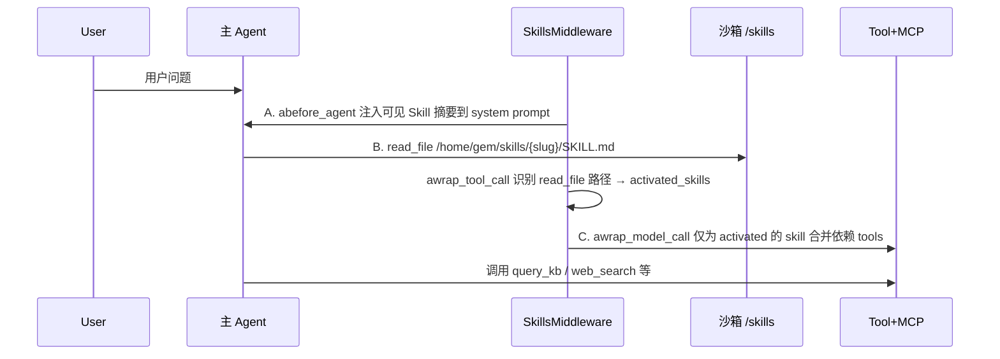
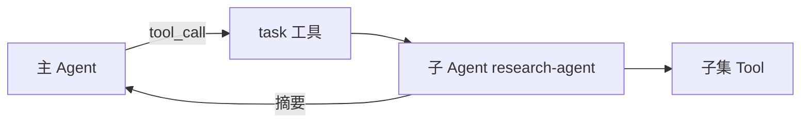
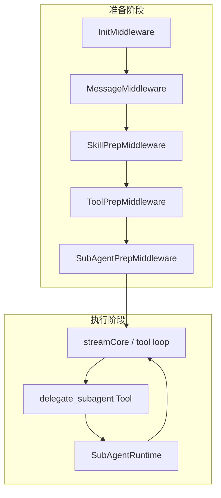
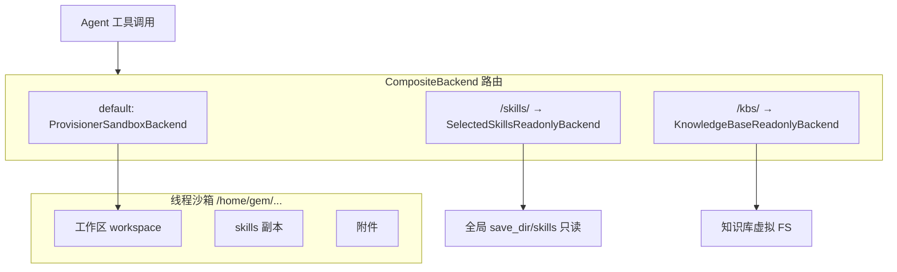
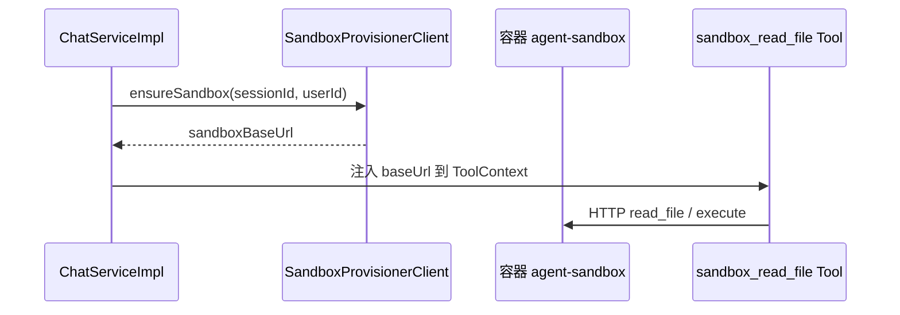

# LightBot Skill / SubAgent 设计参考文档（对标 Yuxi）

> 文档版本：2026-05-28（v1.2：P1 Skill 轻编排 + P2 SubAgent delegate 已在主仓落地，见第二十节）  
> 参考项目：`E:\Pycharm\dev\Yuxi\backend`（Python + LangChain + deepagents）  
> 目标项目：LightBot（Java + Spring AI + Vue3）

---

## 一、文档目的

1. 提炼 Yuxi 后端 **Skill**、**SubAgent** 的设计思想与运行时机制。  
2. 对照 LightBot 现状，说明 **能否借鉴、如何借鉴、不宜照搬什么**。  
3. 给出 **业务逻辑、技术方案、落地流程、难点与分期** ，供后续研发排期。  
4. 说明 **文件沙箱的作用**、**Java 技术栈实现路径**、**Skill 存 MinIO** 的可行性与目录规范。

---

## 二、结论摘要（给决策者）

| 问题 | 结论 |
|------|------|
| Yuxi 的 Skill/SubAgent 是否有参考价值？ | **有**。分层清晰：Tool/MCP/KB = 能力；Skill = 编排；SubAgent = 委派。 |
| LightBot 当前是否已生效？ | **P1+P2 已生效**（见第二十节）：Skill 在 `SkillPrepMiddleware` 注入 prompt + 合入额外工具/MCP；SubAgent 通过 `delegate_to_subagent` 工具同步委派。 |
| 建议落地顺序 | **P0 统一概念 → P1 Skill 轻编排 → P2 SubAgent 委派 → P3 MinIO Skill + 虚拟 FS → P4 执行沙箱（按需）** |
| Skill 存 MinIO？ | **推荐**。与现有 `MinioUtil`、知识库/附件一致，利于多实例与备份；DB 只存元数据与 `object_prefix`。 |
| 文件沙箱是否必须？ | **一期不必须**。Skill 可用 `read_skill` + MinIO 替代 Yuxi 的 `read_file`+本机目录；**代码执行/多文件工作区** 才需要完整沙箱。 |
| 最大难点 | Java 无 deepagents；委派与 Skill 激活需自研；完整沙箱需容器编排或接受「无 execute」的轻量 FS。 |

---

## 三、Yuxi 架构速览

### 3.1 运行时分层

```text
用户消息
  → chat_service 构建 BaseContext（skills / subagents / tools / mcps / knowledges）
  → ChatbotAgent.get_graph() 按 context 组装 Middleware 链
  → LangGraph graph.ainvoke / astream
```

**Middleware 顺序（`chatbot/graph.py`）**：

```text
FilesystemMiddleware
  → save_attachments_to_fs
  → KnowledgeBaseMiddleware      # 知识库工具 + 虚拟 FS
  → RuntimeConfigMiddleware      # 用户选的 tools / mcps / model / system_prompt
  → SkillsMiddleware             # Skill 提示词 + 依赖展开 + 懒激活
  → SubAgentMiddleware           # task 工具委派子 Agent
  → SummaryOffloadMiddleware
  → TodoListMiddleware
  → PatchToolCallsMiddleware
  → ModelRetryMiddleware
```

### 3.2 四类能力的正交关系（Yuxi）

| 概念 | 本质 | 存储 | 进入 Agent 的方式 |
|------|------|------|-------------------|
| **Tool** | 可执行函数（`@tool`） | 代码注册表 | `context.tools` → RuntimeConfig |
| **MCP** | 外部工具源 | DB + 运行时 Client | `context.mcps` → RuntimeConfig；也可被 Skill 依赖拉起 |
| **Knowledge** | RAG 数据域 | LightRAG/MinIO 等 | `context.knowledges` → KB 工具 + `/home/gem/kbs/` 只读 FS |
| **Skill** | **指令包**（SKILL.md + 依赖声明） | **文件 + DB 元数据** | `context.skills` 注入摘要；`read_file` 读 SKILL.md 后 **激活** 并挂载依赖 Tool/MCP |
| **SubAgent** | **独立子推理体** | DB `subagents` 表 | `context.subagents` 子集 → `SubAgentMiddleware` 注入 **`task` 工具** |

**关键原则（Yuxi）**：

- Skill **不执行代码**，执行仍走 Tool/MCP。  
- SubAgent **单独开上下文**，通过 `task(name, task_description)` 委托，返回摘要给主 Agent。  
- Skill 与 SubAgent **无硬耦合**；可并行存在。

---

## 四、Yuxi Skill 设计详解

### 4.1 数据模型

**文件**：`{save_dir}/skills/{slug}/SKILL.md`

- YAML frontmatter：`name`、`description`  
- Markdown 正文：操作步骤、输出格式、何时用哪些 Tool/MCP  

**DB 表 `skills`（`models_business.Skill`）**：

| 字段 | 含义 |
|------|------|
| `slug` | 全局唯一标识（目录名） |
| `tool_dependencies` | 依赖内置工具名列表 |
| `mcp_dependencies` | 依赖 MCP 服务名列表 |
| `skill_dependencies` | 依赖其他 skill（闭包展开） |
| `dir_path` | 相对存储路径 |
| `is_builtin` / `content_hash` | 内置 Skill 版本管理 |

### 4.2 运行时三阶段（`SkillsMiddleware`）



| 阶段 | 钩子 | 行为 |
|------|------|------|
| A 可见性 | `abefore_agent` | `expand_skill_closure` 展开 skill 依赖；注入 `SKILLS_SYSTEM_PROMPT` + 各 skill 的 name/description/path |
| B 激活 | `awrap_tool_call` | 拦截 `read_file`，路径匹配 `.../skills/{slug}/SKILL.md` 且 slug 在可见集 → 写入 state `activated_skills` |
| C 挂载 | `awrap_model_call` | 对 **已激活** skill 解析 tool/mcp 依赖，merge 进本次 model request 的 tools |

**设计亮点**：

- **懒激活**：先给摘要，模型主动 `read_file` 才加载完整 SKILL 与工具，节省 token。  
- **依赖闭包**：配置 skill A 可自动带出依赖 skill B（DFS + 环检测）。  
- **安全**：仅允许激活「配置可见」的 slug，防止任意路径激活。

### 4.3 与文件系统

- 线程级：`sync_thread_visible_skills` 把选中 skill 复制到 `threads/{thread_id}/skills/`。  
- `SelectedSkillsReadonlyBackend`：Agent 只能读可见 slug 目录。  
- 虚拟路径：`/home/gem/skills`（沙箱内）。

---

## 五、Yuxi SubAgent 设计详解

### 5.1 数据模型（`subagents` 表）

| 字段 | 含义 |
|------|------|
| `name` | 主键，如 `research-agent` |
| `description` | 给主 Agent 看，何时委托 |
| `system_prompt` | 子 Agent 系统提示词 |
| `tools` | 工具名字符串列表 |
| `model` | 可选覆盖模型 |
| `enabled` / `is_builtin` | 启停与内置 |

内置示例：`research-agent`（`tavily_search`）、`critique-agent`（无工具）。

### 5.2 注册与选择

- 启动：`init_builtin_subagents()` upsert 到 DB。  
- 运行时：`BaseContext.subagents: list[str]` — Agent 配置页勾选子集。  
- `get_subagents_from_names()`：DB spec → 解析 tools 为 LangChain 实例。

### 5.3 调用机制（deepagents `SubAgentMiddleware`）

- 向主 Agent 增加 **`task` 工具**（非 Yuxi 自研）。  
- 主 Agent 调用：`task(name="research-agent", task="调研 XX 并总结")`。  
- 子 Agent 在**隔离上下文**中跑完，返回**摘要**给主 Agent。  
- `general_purpose_agent=True`：即使未配置具名 subagent，仍保留通用子 Agent。



---

## 六、LightBot 现状对照

### 6.1 已有能力矩阵

| 模块 | LightBot 现状 | 对话运行时 |
|------|---------------|------------|
| Tool | `tool` 表 + `@Tool` 实现 | ✅ `ToolPrepMiddleware` → `resolveToolCallbacksByIds` |
| MCP | `mcp_server` + `McpClientService` | ✅ 合并进 `ToolCallback` |
| 知识库 | `knowledge` 绑定 + `QueryKnowledgeTool` | ✅ 经 Agent 绑定工具 |
| Skill | `skill` 表，`agent_id` + `tool_id` + `prompt_template` | ❌ 无 chat 引用；AgentDetail 标「开发中」 |
| SubAgent | `subagent` 表 + `agent.config.subagents` | ❌ 无 chat 引用（与 Yuxi 内置注册类似，但未委派） |

### 6.2 LightBot 对话中间件链

```text
Init → UserSensitive → Workflow → Message → ToolPrep → Trace → streamCore
```

- **MessageMiddleware**：systemPrompt + 工具引导（`buildToolGuide`）。  
- **ToolPrepMiddleware**：Agent 的 tools + MCP，**不读 Skill/SubAgent**。  
- **WorkflowMiddleware**：WORKFLOW 类型走 DAG，**完全绕过** LLM 链（Skill/SubAgent 需单独考虑）。

### 6.3 与 Yuxi 的结构差异

| 维度 | Yuxi | LightBot |
|------|------|----------|
| Agent 框架 | LangChain `create_agent` + Middleware | Spring AI `ChatModel` + 自研 Middleware |
| Skill 存储 | 全局 slug + 文件 SKILL.md | 按 `agent_id` 一行一条，prompt 在 DB |
| Skill 激活 | read_file + state | 无 |
| SubAgent 调用 | deepagents `task` 工具 | 无 |
| 上下文对象 | `BaseContext` dataclass | `ChatContext` + `ChatRequest` |
| 文件沙箱 | ProvisionerSandbox + composite backend | MinIO 附件，无 skill 目录 |

---

## 七、概念映射：借鉴什么、不照搬什么

### 7.1 建议采纳的 Yuxi 思想

| Yuxi 做法 | LightBot 映射 |
|-----------|---------------|
| Skill = 编排层，不替代 Tool | `Skill` 只负责 **何时/如何用**，执行仍走 Tool/MCP/KB |
| Skill 依赖声明 `tool_dependencies` / `mcp_dependencies` | `skill` 表增加 JSON 依赖字段，或 `config` 内规范 |
| Skill 懒激活（摘要 → 详读 → 挂工具） | **简化版**：配置即激活，或「命中意图 → 注入全文 prompt」 |
| SubAgent 通过 **单一委派工具** `task` | 自研 `delegate_to_subagent` Tool，内部跑子对话 |
| Middleware 分层：KB → Runtime → Skill → SubAgent | 在 `ToolPrep` 前/后插入 `SkillPrepMiddleware`、`SubAgentPrepMiddleware` |
| `BaseContext` 统一挂载 skills/subagents | `agent.config` 或 `ChatRequest` 扩展 `skillIds` / `subAgentIds`（可选覆盖） |

### 7.2 不宜一期照搬的部分

| Yuxi 能力 | 原因 | LightBot 替代 |
|-----------|------|----------------|
| 完整 **Provisioner 容器沙箱** + `execute` | 需 Docker/K8s + agent-sandbox 服务，运维成本高 | 见 **第十六章**：分 Level 1~4 渐进 |
| 本机 `save_dir/skills` 目录 | 多实例、扩缩容不一致 | **MinIO 对象存储**（见第十八章） |
| `read_file` 路径激活 Skill | 依赖 FilesystemMiddleware | `read_skill(slug)` 读 MinIO，效果等价 |
| `skill_dependencies` 闭包 + thread 级 skill 副本 | 可二期再做 | 一期 DB prompt；三期 MinIO 按需 copy 到 `threads/{id}/skills/` |
| `general_purpose_agent` 通用子 Agent | 易与主 Agent 能力重复 | 先做具名 SubAgent |
| 依赖 deepagents 的 `SKILLS_SYSTEM_PROMPT` | 无对应库 | Java 模板复写同等语义 |

---

## 八、LightBot 推荐目标架构

### 8.1 分层定义（与 Yuxi 对齐）

```text
┌─────────────────────────────────────────────────────────┐
│ 编排层：Skill（轻） / SubAgent（重） / Workflow（图）      │
├─────────────────────────────────────────────────────────┤
│ 能力层：Tool（内置+自定义） / MCP（外部）                 │
├─────────────────────────────────────────────────────────┤
│ 数据层：Knowledge（RAG） / 对话附件（Tika 文本）          │
└─────────────────────────────────────────────────────────┘
```

### 8.2 Skill vs SubAgent 边界（避免与 Yuxi 一样踩坑）

| 维度 | Skill | SubAgent |
|------|-------|----------|
| 定位 | 能力剧本 / 使用手册 | 子任务执行者 |
| 是否单独 LLM 轮次 | 否（注入主 Agent） | 是（独立 system + messages） |
| 工具 | 声明依赖，合并到主 Agent tool 列表 | 子集工具，仅在子对话可用 |
| 典型 API 成本 | 低 | 中高 |
| 用户感知 | 「这个 Agent 会按 SOP 用工具」 | 「助手派了研究员去查资料」 |

**与 Tool/MCP/KB 不重复**：

- 不在 Skill 里实现 HTTP/查库 → 仍注册为 Tool。  
- 不在 Skill 里存知识正文 → 仍走 Knowledge + `query_knowledge`。  
- MCP 仍是工具来源；Skill 只写「先调 charts MCP 再总结」。

---

## 九、业务逻辑设计（LightBot）

### 9.1 Skill 业务流

```text
【配置态】
  管理员在「扩展 → Skill」或「Agent 详情 → Skill」维护技能
    → 名称、描述、prompt_template、依赖 tools/mcps/knowledges、enabled、sort_order

【发布态】
  Agent 绑定 enabled 的 skillId 列表（写入 agent.config.skills，与 tools/knowledges 并列）

【对话态】
  1. InitMiddleware 加载 Agent + config
  2. SkillPrepMiddleware：
       - 读取绑定且 enabled 的 Skill 列表
       - （一期）全部视为 activated，或按关键词/规则匹配子集
       - 展开依赖：合并额外 toolId、mcpServerId（校验 Agent 是否也有权）
       - 将 Skill 描述 + prompt_template 拼入 system 或 tool guide
  3. ToolPrepMiddleware：Agent tools + MCP + Skill 带来的额外工具（去重）
  4. MessageMiddleware：已有 buildToolGuide，与 Skill 指引合并
  5. streamCore：正常 tool loop
```

**业务规则建议**：

- Skill 依赖的 Tool/MCP **必须是 Agent 已绑定子集的超集子集**（防止 Skill 越权提权）。  
- 未 enabled 的 Skill 不参与对话。  
- Workflow 类型 Agent：**默认不走 Skill**（或仅 LLM 节点可选），避免与 DAG 语义冲突。

### 9.2 SubAgent 业务流

```text
【配置态】
  全局 SubAgent 库（已有 subagent 表）+ Agent 绑定 subagents（已有）

【对话态】
  1. SubAgentPrepMiddleware（或合并进 ToolPrep）：
       - 根据 agent.config.subagents 加载 enabled SubAgent
       - 注册系统 Tool：delegate_subagent(name, task)
  2. 主 Agent 在需要时 tool_call delegate_subagent
  3. SubAgentRuntime：
       - 新建临时 message 列表（system=子 prompt，user=task）
       - 解析子 tools（by name → ToolCallback）
       - 可选 modelId 覆盖
       - 执行一轮/多轮 tool loop（限制 max_depth=1~2）
       - 返回摘要文本给主 Agent
  4. 主 Agent 基于摘要继续回复用户
```

**业务规则建议**：

- 单条用户消息内 SubAgent 委派 **最多 N 次**（如 3），防止套娃。  
- SubAgent **不能**再委派 SubAgent（一期）。  
- 流式：可对 `delegate_subagent` 发 `STATUS` 事件「正在调用 xxx 子智能体…」。

### 9.3 与现有模块的协作

| 场景 | 行为 |
|------|------|
| 用户开联网搜索（MiMo） | ToolPrep 已禁用自定义工具；Skill 仅注入 prompt，**不追加** tool |
| 用户绑 knowledge + Skill「合规审查」 | Skill prompt 要求先 `query_knowledge` 再结论 |
| Playground / Chat | 同一套 Middleware，Playground 需传 agentId |
| Agent 版本发布 | 版本快照需包含 `skillIds`、`subAgentIds`（参考现有 tool/knowledge） |

---

## 十、技术设计（LightBot）

### 10.1 数据模型演进

#### Skill 表（建议调整）

当前 `skill.agent_id` 导致技能无法复用。建议改为 **全局 Skill + Agent 绑定**（与 Yuxi 全局 slug 一致）：

```sql
-- 示例：2026-05-26-00X.sql（实施时按项目 sql 目录规范编号）

-- skill 定义表（全局）
ALTER TABLE skill ... -- 或新建 skill_definition

-- agent 绑定（可放 agent.config.skills: string[]）
-- config JSON: "skills": ["skill-id-1", "skill-id-2"]
```

**字段建议**（在现有基础上扩展）：

| 字段 | 类型 | 说明 |
|------|------|------|
| `slug` | varchar | 唯一，可选，对接未来 SKILL.md |
| `tool_ids` | jsonb | 多 Tool（替代单一 `tool_id`） |
| `mcp_server_ids` | jsonb | 依赖 MCP |
| `knowledge_ids` | jsonb | 优先检索库（指引级，非存正文） |
| `skill_dependencies` | jsonb | 依赖其他 skill id（二期） |
| `activation_mode` | varchar | `always` / `keyword` / `manual` |
| `keywords` | jsonb | activation_mode=keyword 时 |
| `content_path` | varchar | 二期：MinIO 上 SKILL.md 路径 |

#### SubAgent 表

现有结构已接近 Yuxi，保持：

- `name`（唯一）、`system_prompt`、`tools`（JSON 工具名）、`model_id`、`enabled`  
- Agent 绑定：`agent.config.subagents`（已有）

#### ConfigKeys 扩展

```java
// ConfigKeys.Agent
public static final String SKILLS = "skills";
public static final String SUBAGENTS = "subagents"; // 已有 subagents 字段
```

### 10.2 新增中间件

```text
Init
  → UserSensitive
  → Workflow
  → Message          （systemPrompt + 平台约束）
  → SkillPrep        【新增】注入 Skill 指引、解析依赖 tool/mcp
  → ToolPrep         （合并 Agent + Skill 工具）
  → SubAgentPrep     【新增】注册 delegate_subagent 工具
  → Trace
  → streamCore
```

#### `SkillPrepMiddleware`（一期最小实现）

```java
// 伪代码职责
void prepare(ChatContext ctx) {
  List<Long> skillIds = agentService.getSkillIds(ctx.getAgent().getId());
  List<Skill> skills = skillService.listEnabledByIds(skillIds);
  List<Skill> activated = matchSkills(skills, ctx.getRequest().getMessage()); // 一期可全量
  ctx.setActivatedSkills(activated);
  ctx.setSkillSystemAppendix(buildSkillPrompt(activated)); // 拼入 MessageMiddleware 或此处写 ctx
  ctx.setExtraToolIds(collectToolIds(activated));
  ctx.setExtraMcpServerIds(collectMcpIds(activated));
}
```

#### `SubAgentPrepMiddleware` + `DelegateSubAgentTool`

```java
@Tool(name = "delegate_subagent", description = "...")
public String delegate(String name, String task, ToolContext ctx) {
  SubAgent sub = subAgentService.getByName(name);
  // 校验 agent 绑定 + enabled
  return subAgentRuntime.run(sub, task, parentCtx);
}
```

`SubAgentRuntime`：

- 独立 `List<Message>`，不写入主会话 history（或仅写 metadata 记录委派事件）。  
- 使用 `ModelFactory.getChatModel`（子 `model_id` 或继承主 Agent）。  
- 工具：`toolService.resolveToolCallbacks(sub.getTools())`。  
- 限制：`maxToolDepth`、`timeout`。

### 10.3 与 MessageMiddleware / ToolPrep 集成点

**MessageMiddleware.buildMessages**：

```java
String systemPrompt = agent.getSystemPrompt();
systemPrompt += ctx.getSkillSystemAppendix(); // 来自 SkillPrep
// 原有 tool guide ...
```

**ToolPrepMiddleware.buildChatOptionsWithTools**：

```java
toolIds.addAll(ctx.getExtraToolIds());
mcpServerIds.addAll(ctx.getExtraMcpServerIds());
// 去重 + 权限校验
```

### 10.4 前端改造要点

| 页面 | 改造 |
|------|------|
| AgentDetail | 启用 Skill Tab：绑定 skill 列表（对标 SubAgents Tab） |
| SkillManage | 支持多 tool、MCP、激活模式；去掉「仅属某 Agent」或改为可选 |
| Chat / Playground | 可选展示「已激活 Skill」调试信息（开发者模式） |
| 版本发布 | 快照含 `skills` 绑定 |

### 10.5 API 补充

| 接口 | 说明 |
|------|------|
| `GET /agents/{id}/skills` | 绑定列表（若未用 config 内嵌） |
| `PUT /agents/{id}/skills` | 更新绑定 |
| `GET /skills/enabled` | 可选技能池 |

（SubAgent 已有 `/agents/{id}/subagents`。）

---

## 十一、落地流程（分阶段）

### Phase 0：对齐与文档（1 周）

- [ ] 评审本文档，确定 Skill **全局 vs 按 Agent** 模型。  
- [ ] 确定 SubAgent 委派工具名、深度限制、流式 STATUS 格式。  
- [ ] 更新 `docs/features.md` 中 Skill 章节（当前仍写「待实现」）。

### Phase 1：Skill 轻量编排（2~3 周）

| 步骤 | 内容 |
|------|------|
| 1.1 | DB/config：`agent.config.skills` + Skill 表扩展 `tool_ids`/`mcp_server_ids` |
| 1.2 | `AgentService.getSkillIds` / `updateSkillBindings` |
| 1.3 | `SkillPrepMiddleware` + `ChatContext` 字段 |
| 1.4 | 接入 `MessageMiddleware`、`ToolPrepMiddleware` |
| 1.5 | AgentDetail Skill Tab + 保存绑定 |
| 1.6 | 单测：绑定 Skill 后 system prompt 含指引；依赖 tool 进入 options |

**验收**：绑定「需先 query_knowledge 再回答」的 Skill 后，对话能稳定先调知识库。

### Phase 2：SubAgent 委派（2~3 周）

| 步骤 | 内容 |
|------|------|
| 2.1 | `DelegateSubAgentTool` + `SubAgentRuntime` |
| 2.2 | `SubAgentPrepMiddleware` 注册工具；绑定校验 |
| 2.3 | 流式 STATUS：`subagent_start` / `subagent_done` |
| 2.4 | Trace/可观测：子调用 span |
| 2.5 | 限制：深度、超时、次数 |

**验收**：主 Agent 调用 `delegate_subagent(research-agent, ...)` 能返回调研摘要并继续对话。

### Phase 3：MinIO Skill + 虚拟文件能力（2~3 周）

- Skill 正文迁 MinIO：`skills/{slug}/SKILL.md` + DB 元数据（见第十八章）。  
- 内置 `read_skill` / `list_skill_files` Tool（Level 1 虚拟 FS，无容器）。  
- Skill 关键词激活、`skill_dependencies` 闭包。  
- 管理端：技能 ZIP 导入、MinIO 文件树预览（可复用知识库 `FilePreview`）。  
- 懒激活：`SkillsMiddleware` 等价逻辑 — 摘要注入 → 模型调 `read_skill` → 挂载依赖 Tool/MCP。

### Phase 4：会话工作区与执行沙箱（按需，4~8 周）

- Level 2：`threads/{sessionId}/workspace/` 读写 Tool（MinIO 后端）。  
- Level 3：Docker 单会话容器 + `SandboxProvisioner` HTTP API（对齐 Yuxi Provisioner）。  
- 附件落盘、长工具结果 offload 到工作区路径。  
- Workflow 节点：`SubAgentNode` / `SkillNode`。

---

## 十二、难点与风险

| 难点 | 说明 | 缓解 |
|------|------|------|
| **无 deepagents** | `task` 委派、FS、SKILLS_SYSTEM_PROMPT 需自研 | 一期 Java 实现最小 `SubAgentRuntime`；Prompt 模板化 |
| **Spring AI Tool 循环** | 子 Agent 内仍要 tool loop，与 `ChatServiceImpl.streamCore` 集成复杂 | 抽取 `ToolLoopExecutor` 共用；子调用用非流式或短流式 |
| **MiMo 直连** | 联网模式禁用 Agent 工具 | Skill 仅 prompt；SubAgent 委派前检测 provider 能力 |
| **工具权限** | Skill 依赖的 tool 未绑定 Agent | 启动时校验；保存 Skill 绑定时报错 |
| **上下文膨胀** | 多 Skill 全文注入 | 一期限制每 Agent ≤5 个 Skill；仅注入 description + 短模板 |
| **SubAgent 与 Skill 重叠** | 都带 prompt+tools | 产品规则：SubAgent 用于「子任务」；Skill 用于「主 Agent SOP」 |
| **Workflow 分支** | DAG Agent 不走 Message/ToolPrep | 文档标明不支持，或 LLM 节点单独加载 Skill |
| **版本与草稿** | 绑定存在 config vs 版本快照 | 与 knowledge/tools 一致，走 `AgentVersionService` |
| **可观测性** | 子调用 token、延迟 | `LlmTrace` 增加 parentSpanId |
| **MinIO 与 DB 一致性** | 上传 SKILL.md 成功但 DB 未提交 | 两阶段：先 MinIO 后 DB；或事务补偿删除对象 |
| **沙箱安全** | `execute` 任意命令 | 容器隔离 + 网络策略 + 超时/输出上限（对标 Yuxi `max_output_bytes`） |
| **多实例 Skill 缓存** | 每请求读 MinIO 延迟 | 本地 Caffeine 缓存 slug→正文，版本号失效 |

---

## 十三、测试计划（摘要）

| 类型 | 用例 |
|------|------|
| 单元 | `expandSkillDependencies`、`matchSkillsByKeyword`、`SubAgentRuntime` 工具解析 |
| 集成 | 绑定 Skill → 对话 → 断言 tool 列表含依赖 |
| 集成 | 绑定 SubAgent → 对话触发 delegate → 断言返回摘要 |
| 回归 | MiMo 联网、Workflow Agent、附件+多模态 不受影响 |
| 安全 | 未绑定 SubAgent 的 name 调用 delegate 应 403 |

---

## 十四、附录

### A. Yuxi 关键文件索引

| 路径 | 职责 |
|------|------|
| `package/yuxi/agents/context.py` | `skills`、`subagents` 配置项 |
| `package/yuxi/agents/middlewares/skills_middleware.py` | Skill 三阶段 |
| `package/yuxi/agents/buildin/chatbot/graph.py` | Middleware 链装配 |
| `package/yuxi/services/skill_service.py` | Skill CRUD、导入、依赖校验 |
| `package/yuxi/services/subagent_service.py` | SubAgent CRUD、`get_subagents_from_names` |
| `package/yuxi/storage/postgres/models_business.py` | `Skill`、`SubAgent` ORM |
| `deepagents.middleware.subagents.SubAgentMiddleware` | `task` 工具（外部库） |

### B. LightBot 关键文件索引

| 路径 | 职责 |
|------|------|
| `entity/Skill.java` | 当前 Skill 模型（待演进） |
| `entity/SubAgent.java` | SubAgent 模型 |
| `service/impl/AgentServiceImpl.java` | `getSubAgentIds` / 绑定读写 |
| `service/chat/ToolPrepMiddleware.java` | 工具加载（待扩展） |
| `service/chat/MessageMiddleware.java` | system + tool guide |
| `service/impl/ChatServiceImpl.java` | `chatStream` 中间件链 |
| `subagent/BuiltInSubAgentRegistrar.java` | 内置 SubAgent 注册（未接入对话） |
| `views/AgentDetail.vue` | SubAgents 绑定 UI；Skill 占位 |
| `util/MinioUtil.java` | 已有上传/下载/预签名，Skill/工作区可复用 |

### C. 规划新增模块（第十六章~十八章）

| 路径 | 职责 |
|------|------|
| `skill/SkillStorageService.java` | MinIO `skills/{slug}/` 读写、ZIP 导入 |
| `skill/SkillMarkdownParser.java` | SKILL.md frontmatter 解析 |
| `sandbox/WorkspaceStorageUtil.java` | Level 2 会话工作区 MinIO |
| `sandbox/SandboxProvisionerClient.java` | Level 3 容器沙箱 HTTP 客户端 |
| `tool/systemtool/ReadSkillTool.java` | 替代 Yuxi `read_file` 激活 Skill |

### D. 参考图示：LightBot 目标对话链



---

## 十六、文件沙箱：作用与 Yuxi 实现

### 16.1 文件沙箱是什么

在 Yuxi 中，「文件沙箱」不是简单的磁盘目录，而是 **按对话线程（thread）隔离的、可被 Agent 通过工具操作的虚拟工作区**，通常由独立 **Sandbox Provisioner** 拉起容器（`agent-sandbox` 客户端），每个 `thread_id` 对应一个沙箱实例。

对模型暴露的能力（经 `FilesystemMiddleware` + `CompositeBackend` 路由）：

| 能力 | 典型工具/操作 | 用途 |
|------|----------------|------|
| **读文件** | `read_file` | 读 Skill 正文、读用户附件、读 offload 的大段工具输出 |
| **写文件** | `write_file` / `edit` | 生成代码、报告、图表数据文件 |
| **列目录** | `ls` / `glob` | 浏览工作区与技能目录 |
| **搜内容** | `grep` | 在 workspace 或 skill 目录内搜索 |
| **执行命令** | `execute` | 跑 Python/Shell 验证代码、安装依赖（**风险最高**） |
| **上传下载** | `upload` / `download` | 与用户交换产物文件 |

### 16.2 在 Yuxi 中的四大作用



**作用 1 — 会话工作区（最重要）**

- 用户说「写一个冒泡排序并保存」：Agent 在沙箱内 `write_file` + `execute` 验证。  
- 产物留在 `threads/{thread_id}/` 下，不污染宿主机或其他用户。

**作用 2 — Skill 懒激活载体**

- 配置层把可见 skill 列表注入 system prompt（仅 name/description/path）。  
- 模型调用 `read_file("/home/gem/skills/reporter/SKILL.md")` 才加载完整 SOP。  
- `SkillsMiddleware` 拦截该路径 → 写入 `activated_skills` → 挂载 `tool_dependencies` / `mcp_dependencies`。  
- `sync_thread_visible_skills` 会把选中 skill **复制进线程沙箱**，使 `read_file` 读到的是线程内副本。

**作用 3 — 附件与大数据 offload**

- `save_attachments_to_fs`：上传文件落到沙箱路径，提示模型用 `read_file` 按需读取（避免整文件塞进 context）。  
- `SummaryOffloadMiddleware`：过长工具输出写入虚拟路径，模型需要时再 `read_file`。

**作用 4 — 知识库只读挂载**

- `/home/gem/kbs/{kb_id}/` 映射到知识库虚拟 FS，与 `query_kb` 工具互补（直接读文件 vs 语义检索）。

### 16.3 安全与隔离要点（Yuxi 已实现）

| 机制 | 说明 |
|------|------|
| 线程级沙箱 ID | `sandbox_id_for_thread(thread_id)`，会话间磁盘/进程隔离 |
| 路径规范化 | 禁止 `..` 路径穿越 |
| Skill 只读 + 白名单 | `SelectedSkillsReadonlyBackend` 仅允许已选 `slug` |
| 执行超时与输出上限 | `sandbox_exec_timeout_seconds`、`sandbox_max_output_bytes` |
| Skill 激活守卫 | 仅可见 slug 的 `SKILL.md` 才能激活依赖工具 |

### 16.4 LightBot 是否需要「同等沙箱」

| 产品能力目标 | 是否需要完整沙箱 |
|--------------|------------------|
| Skill 说明 + 依赖 Tool | **否** — `read_skill` + MinIO 即可 |
| 对话附件预览/解析 | **否** — 已有 Tika + MinIO 附件 |
| 知识库 RAG | **否** — 已有 `query_knowledge` |
| Agent 写代码并运行验证 | **是** — 需要 `execute` + 隔离 |
| 多文件项目式协作 | **是** — 需要 workspace 读写 |

**结论**：LightBot 作为企业 Agent 平台，**短期不必复刻 Yuxi 容器沙箱**；中长期若支持「代码执行 / 数据分析脚本」，再引入 Level 3。

---

## 十七、Java 技术栈实现文件沙箱的思路

原则：**与现有架构一致** — 沙箱能力封装为 `Util` / `Service`，业务经 **Tool 接口** 暴露，禁止在 Service 里直接 `Runtime.exec`。

### 17.1 分阶段能力模型（推荐）

```text
Level 0（现状）  MinIO 存对象 + 预签名 URL，无 Agent 文件工具
Level 1          虚拟 FS Tool：read_skill / read_workspace_file（只读 MinIO）
Level 2          会话工作区：read / write / list（MinIO prefix，无 execute）
Level 3          容器沙箱：execute + 完整 FS（对齐 Yuxi Provisioner）
Level 4（可选）  K8s Job / gVisor 强隔离，多租户大规模
```

### 17.2 Level 1：虚拟 FS（Skill + 只读资源）— 优先落地

**实现要点**：

```text
SkillStorageService（封装 MinioUtil）
  ├── getSkillMarkdown(slug) → String
  ├── listSkillObjects(slug, prefix) → List<ObjectInfo>
  └── putSkillPackage(slug, zipStream) → 解压上传到 skills/{slug}/

系统 Tool（@Component）：
  ├── read_skill(slug)           // 替代 Yuxi read_file SKILL.md
  ├── list_skill_files(slug)     // 列出 skills/{slug}/ 下文件
  └── read_session_file(path)    // 读 threads/{sessionId}/... 可选
```

**激活流程（对齐 Yuxi SkillsMiddleware）**：

1. `SkillPrepMiddleware` 注入可见 skill 摘要。  
2. 模型调用 `read_skill("reporter")`。  
3. `SkillActivationHook`（可在 Tool 执行后回调）标记 `activatedSkills`。  
4. 下一轮 `ToolPrepMiddleware` 合并该 skill 的 tool/mcp 依赖。

**优点**：纯 Java + MinIO，无容器运维；与 LightBot **Java First** 完全一致。  
**缺点**：无 `execute`，不能跑用户代码。

### 17.3 Level 2：MinIO 会话工作区（可写、无执行）

**路径规范**：

```text
s3://{bucket}/threads/{sessionId}/workspace/     # 可读写
s3://{bucket}/threads/{sessionId}/attachments/   # 上传附件副本（可选）
s3://{bucket}/skills/{slug}/                       # 全局 skill 库（管理端写、Agent 读）
```

**新增 `WorkspaceStorageUtil`**：

- `readText(sessionId, relativePath)`  
- `writeText(sessionId, relativePath, content)` — 限制扩展名白名单、单文件大小  
- `list(sessionId, prefix)`  
- 路径校验：`relativePath` 不得含 `..`，不得越出 `workspace/`

**系统 Tool**：`read_workspace_file`、`write_workspace_file`、`list_workspace_files`。

**与对话集成**：

- `MessageMiddleware` 或专用 `AttachmentMiddleware`：用户附件上传后 `copy` 到 `threads/{sessionId}/attachments/{name}`，system _append 提示「可用 read_workspace_file 读取」。  
- 大工具结果：写入 `workspace/tool-output/{requestId}.txt`，返回路径给模型。

### 17.4 Level 3：容器沙箱（对齐 Yuxi Provisioner）

Yuxi 链路：`ProvisionerSandboxProvider` → HTTP 创建/发现容器 → `agent_sandbox.Sandbox` 客户端 → `read_file` / `write_file` / `execute`。

Java 等价架构：



| 组件 | 技术选型 | 说明 |
|------|----------|------|
| `SandboxProvisionerClient` | Spring `RestClient` | `POST /sandboxes` `GET /sandboxes/{id}` `DELETE` |
| 沙箱镜像 | 沿用或裁剪 Yuxi `agent-sandbox` 镜像 | 减少协议重新设计 |
| 生命周期 | 按 `sessionId` 映射，30s keepalive | 对标 `sandbox_keepalive_interval_seconds` |
| Tool 实现 | `SandboxFileTool` / `SandboxExecuteTool` | 内部调 Provisioner 暴露的 HTTP API |
| 配置 | `sandbox.enabled=false` 默认关闭 | 企业按需开启 |

**难点**：镜像维护、资源配额、网络 egress 策略、清理僵尸容器。

### 17.5 Level 4 与其他方案（了解即可）

| 方案 | 适用 | 备注 |
|------|------|------|
| **ProcessBuilder + jailed 目录** | 仅允许 JVM 内脚本 | 隔离弱，不推荐生产 execute |
| **AWS Lambda / 云函数** | 短时无状态执行 | 冷启动、与私有化部署冲突 |
| **WebAssembly (Wasm)** | 安全执行受限逻辑 | 生态与 Java 集成成本高 |
| **K8s Job per invoke** | 强隔离批处理 | 延迟高，适合异步任务非同步对话 |

### 17.6 模块落位（LightBot 包结构）

```text
com.lightbot.sandbox/
  ├── SandboxProvisionerClient.java   # 调外部沙箱服务（Level 3）
  ├── WorkspaceStorageUtil.java     # MinIO 工作区（Level 2）
  └── SandboxPathValidator.java     # 路径安全

com.lightbot.skill/
  ├── SkillStorageService.java      # MinIO skill 库（Level 1）
  └── SkillMarkdownParser.java      # frontmatter 解析

com.lightbot.tool.systemtool/
  ├── ReadSkillTool.java
  ├── ReadWorkspaceFileTool.java
  └── SandboxExecuteTool.java       # Level 3 可选

com.lightbot.service.chat/
  └── SkillPrepMiddleware.java      # 摘要 + 激活态
```

---

## 十八、Skill 存储 MinIO 化方案

### 18.1 结论：**可以，且推荐**

LightBot 已在知识库、对话附件、图片生成等场景使用 `MinioUtil`，Skill 存 MinIO **与现有技术栈一致**，优于 Yuxi 本机 `save_dir`：

| 维度 | 本机目录（Yuxi） | MinIO（LightBot 推荐） |
|------|------------------|-------------------------|
| 多实例部署 | 需共享 NAS/EFS | 原生共享 |
| 备份与版本 | 需自建 | 桶策略 / 版本控制 |
| 与附件/KB 统一 | 另一套路径 | 统一 `s3://bucket/...` |
| 管理端预览 | 直接读盘 | 预签名 URL + `FilePreview` |
| Agent 读取 | `read_file` 沙箱 | `read_skill` 或同步到 thread prefix |

**注意**：MinIO 替代的是 **Skill 内容存储**，不是替代 **执行沙箱**；若需 `execute`，仍要 Level 3 容器。

### 18.2 对象路径规范

```text
{bucket}/
  skills/                              # 全局技能库（管理员/import）
    {slug}/
      SKILL.md                         # 必需：frontmatter + 正文
      references/                      # 可选：模板、示例数据
      scripts/                         # 可选：仅给人看说明，执行仍走 Tool

  skills-builtin/                      # 可选：内置 skill 只读副本（启动时 sync）

  threads/
    {sessionId}/
      skills/                          # 可选：激活前 copy 可见 slug（对标 sync_thread_visible_skills）
        {slug}/SKILL.md
      workspace/                       # Level 2 工作区
      attachments/                     # 用户上传副本
```

**DB `skill` 表（元数据）建议字段**：

| 字段 | 说明 |
|------|------|
| `slug` | 唯一，对应 MinIO `skills/{slug}/` |
| `object_prefix` | 冗余存 `skills/{slug}/`，便于迁移 |
| `content_hash` | 对标 Yuxi，内置 skill 更新检测 |
| `tool_dependencies` / `mcp_dependencies` / `skill_dependencies` | JSON |
| `name` / `description` | 可冗余 frontmatter，列表查询免拉 MinIO |

正文 **以 MinIO 上 SKILL.md 为准**；DB 可缓存 description 用于列表页。

### 18.3 读写流程

**导入（管理端）**

```text
上传 ZIP / SKILL.md
  → SkillService 解析 frontmatter、校验 slug/依赖
  → MinioUtil.upload 到 skills/{slug}/
  → DB insert/update 元数据 + content_hash
```

**对话读取**

```text
SkillPrepMiddleware：DB 查绑定 slug 列表 → 注入摘要（name, description, "调用 read_skill 查看全文"）
模型 → read_skill(slug)
  → SkillStorageService.getSkillMarkdown(slug)  // MinIO getObject，带本地缓存
  → SkillActivationListener 标记 activated
  → 下一轮 ToolPrep 挂载依赖
```

**可选：线程副本（对标 Yuxi）**

- 会话首次激活 slug 时：`copyObject(skills/{slug}/, threads/{sessionId}/skills/{slug}/)`  
- 好处：后续若开放 `read_workspace_file` 统一路径；坏处：存储翻倍 → 建议 **懒 copy** 仅 SKILL.md。

### 18.4 与 Yuxi 机制对照

| Yuxi | LightBot (MinIO) |
|------|------------------|
| `save_dir/skills/{slug}/SKILL.md` | `s3://bucket/skills/{slug}/SKILL.md` |
| `read_file("/home/gem/skills/...")` | `read_skill(slug)` |
| `SelectedSkillsReadonlyBackend` | Tool 内校验 `slug ∈ agent.visibleSkills` |
| `sync_thread_visible_skills` | `SkillStorageService.syncToThread(sessionId, slugs)` 可选 |
| DB `skills` 表索引 | PostgreSQL `skill` 表 + `object_prefix` |

### 18.5 内置 Skill 发布

对标 `BuiltInSubAgentRegistrar` + Yuxi `BuiltinSkillSpec`：

```text
resources/builtin-skills/{slug}/SKILL.md   # 打包在 jar
  → ApplicationRunner 启动时对比 content_hash
  → 有变更则上传 MinIO skills/{slug}/
  → upsert DB
```

### 18.6 风险与对策

| 风险 | 对策 |
|------|------|
| MinIO 不可用 | 降级：DB 保留 `prompt_template` 备份字段 |
| 大文件 skill 包 | 限制 ZIP 大小；scripts 目录默认不交给模型 |
| 预签名 URL 泄露 | 仅管理预览用；Agent 走服务端 `getObject` 不暴露 URL |
| 删除 skill 孤儿对象 | 删除 DB 时异步删 MinIO prefix |

---

## 十九、修订后的落地顺序（含沙箱与 MinIO）

```text
P1  Skill 轻编排（DB prompt + 依赖 tool/mcp）           ← 最快见效
P2  SubAgent delegate_subagent                         ← 重委派
P3  Skill MinIO + read_skill + 管理端导入/预览         ← 对齐 Yuxi 内容形态，无容器
P4  Level 2 会话 workspace（MinIO 读写 Tool）          ← 多文件场景
P5  Level 3 容器沙箱（execute）                        ← 仅当产品需要跑代码
```

---

## 二十、本项目实施变更（P1 + P2 已落地：2026-05-28）

> 本节专门记录 LightBot 仓库为接入 Skill / SubAgent 实际改动的代码，文档之上的设计仍按前述章节为准。

### 20.1 范围与交付物

- **完成阶段**：P1 Skill 轻编排（DB prompt + 依赖 tool/mcp）、P2 SubAgent delegate 委派。  
- **未做**：P3 Skill MinIO（`SKILL.md` + `read_skill` 仍为后续阶段）、P4 工作区、P5 容器沙箱。  
- **设计取舍**：本期 Skill 内容仍存 PG（`skill.prompt_template`），通过 `BuiltInSkillRegistrar` 启动时同步；MinIO 化在 P3 再做。

### 20.2 数据库变更

- 新文件：`sql/2026-05-28-001.sql`
  - `agent_id` 改可空（兼容旧 Agent 私有 Skill）。
  - 新增列：`slug`、`display_name`、`tool_ids` (JSONB)、`mcp_server_ids` (JSONB)、`model_id`、`scope`(`global`/`agent`)、`is_builtin`、`content_hash`、`user_id`。
  - 新增索引：`uk_skill_slug`（部分唯一）、`idx_skill_is_builtin`、`idx_skill_scope`。

### 20.3 后端新增/修改一览

| 类型 | 路径 | 说明 |
|------|------|------|
| 新增 | `com.lightbot.skill.BuiltInSkillDefinitions` | 内置 Skill 清单（slug / 工具依赖 / prompt 模板） |
| 新增 | `com.lightbot.skill.BuiltInSkillRegistrar` | `ApplicationRunner`，启动时按 `content_hash` 同步 5 个内置 Skill 到 DB |
| 新增 | `com.lightbot.service.chat.SkillPrepMiddleware` | 拼接 Skill prompt 追加块 + 解析 `tool_ids` / `mcp_server_ids` 写入 `ChatContext` |
| 新增 | `com.lightbot.subagent.SubAgentRuntime` | 同步执行子 Agent 的工具循环（最多 6 轮）；按主 Agent providerId 调模型 |
| 新增 | `com.lightbot.subagent.DelegateSubAgentTool` | 动态构造 `delegate_to_subagent` 工具回调，描述中列出绑定的 SubAgent 名称与用途 |
| 修改 | `Skill` 实体 / `SkillRequest` / `SkillService(Impl)` / `SkillController` | 支持 global 与 agent 两种 scope，`listGlobal`、`listEnabled`、`setEnabled`、slug 校验 |
| 修改 | `AgentService(Impl)` / `AgentController` | 新增 `getSkillIds` / `updateSkillBindings`；`ErrorCode.AGENT_SKILL_LIMIT`；`getAgentDetail` 返回 `skillIds` |
| 修改 | `ChatContext` | 新增 `skillSystemAppendix` / `skillExtraToolIds` / `skillExtraMcpServerIds` / `activeSkillNames` / `boundSubAgentIds` 字段 |
| 修改 | `MessageMiddleware.buildMessages` | 接受 `ChatContext`；合并 Skill 引入的工具到工具引导；追加 Skill prompt 块到 systemPrompt |
| 修改 | `ToolPrepMiddleware.buildChatOptionsWithTools` | 合并 Agent 自身 + Skill 的 tool/mcp 集合；当存在绑定 SubAgent 时注入 `DelegateSubAgentTool` 回调 |
| 修改 | `ChatServiceImpl` | 同步与流式链路均插入 `skillPrepMiddleware`，顺序：`Init → 用户敏感词 → Workflow → SkillPrep → Message → ToolPrep → Trace` |
| 修改 | `AgentVersionServiceImpl` | 版本快照新增 `skillIds`，预览接口返回 `skills` 摘要列表 |

### 20.4 内置 Skill 清单（开箱即用）

| slug | name | 依赖工具 | 用途 |
|------|------|----------|------|
| `deep-research` | deep_research | `web_search` | 多轮检索 + 结构化整理 |
| `knowledge-grounded-qa` | knowledge_grounded_qa | `query_knowledge` | 知识库严谨问答 |
| `calculator-precise` | calculator_precise | `calculator` | 数值精确计算 |
| `image-create` | image_create | `image_generation` | 图片创作（中文意图→英文 prompt） |
| `db-introspect` | db_introspect | `pg_list_tables` / `pg_describe_table` / `pg_query` | 数据库结构与样本探查 |

启动时 `BuiltInSkillRegistrar` 会按 `content_hash` 增量 upsert；hash 不变则不写库，避免污染审计日志。

### 20.5 运行时对话链（实际生效）

```text
User → Init → 用户敏感词 → Workflow → SkillPrep → Message → ToolPrep → Trace → ChatModel.stream
                                  │             │            │
                                  │             │            └─ 合并: 工具 = Agent.tools ∪ Skill.tool_ids
                                  │             │                MCP  = Agent.mcps  ∪ Skill.mcp_server_ids
                                  │             │                注入 delegate_to_subagent 工具（若有绑定）
                                  │             └─ system prompt = Agent.systemPrompt + 工具引导 + Skill 追加块
                                  └─ 解析绑定 Skill → 生成追加块、汇总额外 tool/mcp ID
```

### 20.6 SubAgent 委派工具协议

工具名固定为 `delegate_to_subagent`，参数 Schema：

```json
{
  "type": "object",
  "properties": {
    "subagent_name": {
      "type": "string",
      "enum": ["research-agent", "critique-agent", "summarize-agent", ...],
      "description": "目标子智能体的 name"
    },
    "task": {
      "type": "string",
      "description": "完整的子任务描述（背景 + 目标 + 期望产物）"
    }
  },
  "required": ["subagent_name", "task"]
}
```

工具 description 由 `DelegateSubAgentTool` 动态拼接当前 Agent **实际绑定且启用** 的 SubAgent 清单，避免模型胡编名称。`SubAgentRuntime` 内部按子 Agent 的 `system_prompt` + `tools(JSON 数组)` 重新组装工具回调，最多 6 轮工具循环，超出深度直接返回当前回复，防止递归爆栈。

### 20.7 前端变更

| 文件 | 说明 |
|------|------|
| `lightbot-ui/src/api/skill.js` | 新增 `getSkills` / `getEnabledSkills` / `setSkillEnabled`；保留旧 `getSkillsByAgent` 兼容接口 |
| `lightbot-ui/src/api/agent.js` | 新增 `getAgentSkillIds` / `updateAgentSkills` |
| `lightbot-ui/src/views/SkillManage.vue` | 重写为全局 Skill 库管理：分页 + slug + 依赖工具/MCP 多选 + 启用切换；内置 Skill 不可编辑/删除 |
| `lightbot-ui/src/views/AgentDetail.vue` | 把原「Skill（暂未开发）」占位换成真实绑定 Tab；新增 `selectedSkillIds`/`skillList` 状态、`toggleSkill`/`removeSkill`/`clearSelectedSkills`/`loadSkillList`；与 SubAgent 选择风格一致；保存时调用 `updateAgentSkills`；版本预览新增 Skill 区块；脏检查、删除标记、绑定上限校验（10 个）全部纳入 |

### 20.8 与现有能力的关系再确认

- Skill 不引入新执行通道：所有真正调用仍由 ToolCallback 完成；Skill 只在 prompt 层和「应该用哪些工具」层施加约束。  
- SubAgent 是一次性的「子上下文」，与主对话共享 `requestId`，但不共享 `messages`；模型可在主对话里多次调用 `delegate_to_subagent`。  
- 知识库（RAG）仍由 `query_knowledge` 单独承担；本期不让 Skill / SubAgent 直接绑定知识库 ID，避免与 Agent 已有的知识库绑定语义重叠。

### 20.9 兼容性与回滚

- 既有 Agent 不绑定 Skill / SubAgent 时，新中间件链对其完全透明：`SkillPrepMiddleware` 会把追加块置空，`DelegateSubAgentTool.buildCallback` 返回 `null`，不影响现有对话。  
- 老的「Agent 私有 Skill」（`scope=agent`）仍可通过 `/api/skills/by-agent/{agentId}` 查询，前端管理已切换到全局视图，但接口保留以便迁移。  
- 回滚仅需还原 `ChatServiceImpl` 中 `skillPrepMiddleware` 引用即可禁用 P1；SubAgent 工具注入由 `ToolPrepMiddleware` 控制，亦可独立关闭。

### 20.10 后续 TODO（按 P3+ 推进）

1. Skill 内容迁 MinIO `s3://bucket/skills/{slug}/SKILL.md`，新增 `read_skill` Tool + `SkillStorageService`，DB 仅保留元数据 + `object_prefix`。  
2. Skill 激活态（懒加载）：仅当模型调用 `read_skill(slug)` 后才把依赖 Tool/MCP 合入下一轮 `toolCallbacks`，进一步降低无关工具污染上下文。  
3. SubAgent 流式回放（按需）：当前 `SubAgentRuntime` 仅同步返回最终文本，后续可改为 SSE 流式片段透传到主对话事件流，便于前端展示中间过程。  
4. 增加 `subAgentService` 在 trace 中的 span，便于排查委派耗时与工具调用链。

---

## 二十一、总结

Yuxi 的核心价值不是「多两张表」，而是 **在对话链路上把 Skill（编排）和 SubAgent（委派）做成了可配置、可观测的中间件能力**。LightBot 已具备 Tool、MCP、知识库、MinIO、SubAgent/Skill 的配置骨架，**缺口在运行时 Middleware、委派工具与 Skill 内容存储形态**。

推荐路径：

1. **先 Skill 后 SubAgent** —— 改造成本低，立刻改善「绑了工具但不会用」的问题。  
2. **Skill 一期可用 DB `prompt_template`**，**三期迁 MinIO `SKILL.md`** —— 不必等沙箱。  
3. **用 `read_skill` 替代 Yuxi 的 `read_file` 激活**，不依赖本机目录。  
4. **文件沙箱分 Level 渐进**：大多数场景 Level 1~2（MinIO 虚拟 FS）即可；**execute 再考虑容器**。  
5. **SubAgent 用 `delegate_subagent` 自研 Runtime**，对齐 Yuxi `task` 语义。  
6. **严格权限与分层**，避免 Skill/SubAgent/Tool/KB 四套并行重复。

本文档可作为 Epic 拆解与评审依据；实施时每个 Phase 应单独更新 `docs/features.md` 与 SQL 变更目录。
